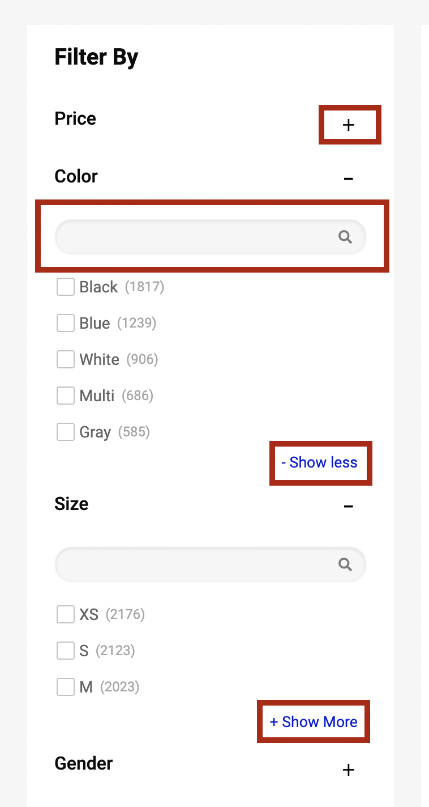
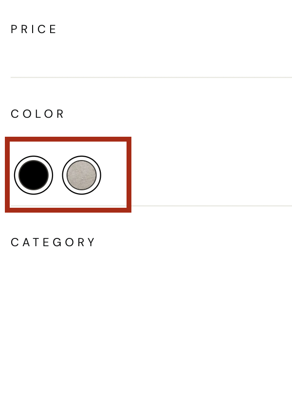
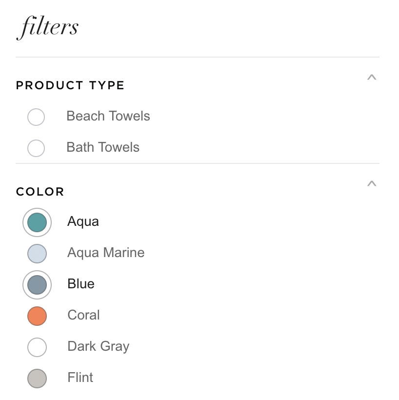
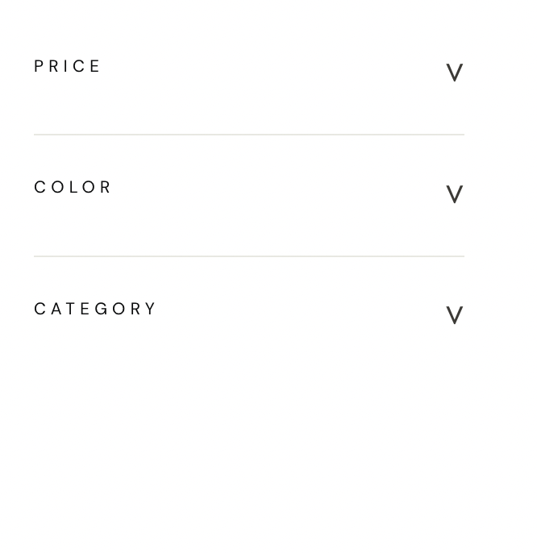
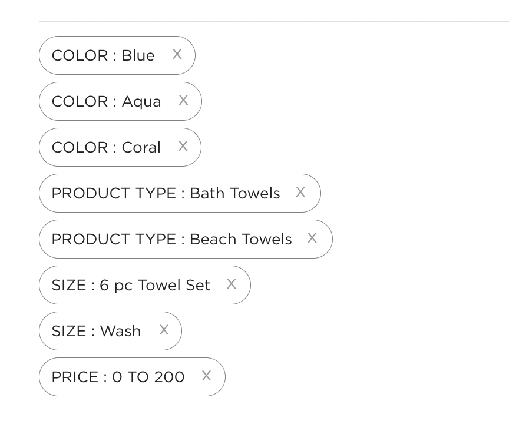

# Facets
{: .no_toc }

# Table of contents
{: .no_toc .text-delta }

1. TOC
{:toc}

---

# Definition

In e-commerce, facets (also known as filters or attributes) are a way to allow customers to narrow down their search results by selecting specific criteria. Facets are typically displayed on the left or right side of a search results page, and can include options such as price range, brand, color, size, and more. They allow customers to quickly and easily find the products they are looking for by narrowing down the options based on their specific needs and preferences.

For example, an e-commerce website for clothing would have facets such as Size, Color, Material, Brand, Gender and so on. By selecting options from the available facets, customers can narrow down the search results to only show products that match the criteria they've selected. This can make it easier for customers to find the specific products they're looking for, and can also increase the chances that they'll make a purchase.

# Behavior

Facets are the products filters provided on your webpage which allows customers to narrow down the search result set.

[](https://unbxd.com/docs/wp-content/uploads/2020/05/Facets-main.png)

# Types of Facets

In e-commerce, facets are used to allow users to filter and narrow down a large dataset of products by specific criteria. There are several types of facets that can be used to achieve this, including:

**Multilevel facets**: These are facets that allow users to filter products based on multiple levels of a category hierarchy. For example, a user could filter products first by category (e.g. clothing, electronics) and then by subcategory (e.g. men's clothing, women's clothing).

**Text facets**: These are facets that allow users to filter products based on text fields, such as product name or brand. For example, a user could search for all products that contain the word "Nike" in their name.

**Range facets**: These are facets that allow users to filter products based on a range of values. For example, a user could filter products by price range, so they only see products that fall within a specific price range. This type of facet is commonly used to filter products based on numeric values such as price, weight, size, etc.


# Configurations

To render the facets on the search results page, you can use the “facet” config object to configure the various options.

```js
facet: {
    //Below configurations should be added here.
}
```
The following options are available under the object:  

## facetsEl
{: .d-inline-block }

Element
{: .label }

Required
{: .label .label-red}

Element in which to render the facets.

"facetsEl" in facets is an HTML element that is designated to display facets. This allows developers to control the placement of the facets on the webpage and to ensure that they are displayed in a prominent and visible location. The "facetsEl" can be set by providing the id or class of the element in the code.

### Default Value
{: .no_toc }

```js
facetsEl: null
```

### Scenarios
{: .no_toc }
There are several HTML selectors that can be used to locate the banner element in an e-commerce page. For ex: getElementById, getElementsByClassName, getElementsByTagName, querySelector, querySelectorAll, getElementsByName, etc.

--- 

## facetTemplate
{: .d-inline-block }

Function
{: .label }

Customize the look and feel of the facets block by returning your custom HTML string from this function. This function accepts following parameters: 
1.  `facetObj`: 
2.  `children`: 
3.  `isExpanded`: is expanded flag (in case you have chosen collapsible facets, i.e. isCollapsible is set to true)
4.  `facetSearchTxt`: the search text entered for this facet block (if isSearchable is set to true)
5.  `facet`: the complete configs for facets.

**Expected Return Value** : A string of HTML that will be used to render the facet block on the webpage.

### Default Value
{: .no_toc }

``` js
facetTemplate: function(facetObj, children, isExpanded,facetSearchTxt, facet) {
        const {
            displayName,
            facetName,
            multiLevelField,
            facetType,
            values
        } = facetObj;
        const {
            facetClass,
            applyMultipleFilters,
            isCollapsible,
            isSearchable,
            searchPlaceHolder,
            textFacetWrapper,
            enableViewMore,
            viewMoreText,
            viewMoreLimit,

            applyButtonText,
            clearButtonText,

        } = facet;
        const {
            actionBtnClass,
            actionChangeClass
        } = this.options;
        const {
            openBtn,
            closeBtn
        } = this.cssList;
        let viewMoreUi = ``;
        let viewMoreCss=``;
        const selected = this.getSelectedFacets()[facetName];
        const isFtr = (selected && selected.length >0)?true:false;
        if(enableViewMore && facetType==="text" && values.length > viewMoreLimit ) {
            viewMoreCss="UNX-view-more";
            viewMoreUi = `<div class="UNX-view-more-row "><button class="${actionBtnClass}" data-facet-name="${facetName}" data-action="viewMore" data-id="${viewMoreText[0]}">${viewMoreText[0]}</button></div>`;
        }
        let clearUI = ``;
        let applyBtn = ``;
        if(isFtr){
            clearUI = `<button class="UNX-facet-clear ${facetClass} "data-facet-action="deleteFacet" data-facet-name="${facetName}">${clearButtonText}</button>`;
        }
        if(applyMultipleFilters && isFtr) {
            applyBtn = `<button class="UNX-facet-primary ${facetClass} "data-facet-action="applyFacets" >${applyButtonText}</button>`
        }
        let collapsibleUI = ``;
        let searchInput = ``;
        if(isCollapsible){
            if(isExpanded) {
                collapsibleUI = `<button class="UNX-collapse-btn ${openBtn} ${actionBtnClass}" data-facet-name="${facetName}" data-facet-action="facetClose"></button>`
            } else {
                collapsibleUI = `<button class="UNX-collapse-btn ${closeBtn} ${actionBtnClass}" data-facet-name="${facetName}" data-facet-action="facetOpen"></button>`
            }
        }
        if(isSearchable && facetSearchTxt !== null) {
            searchInput =`<div class="UNX-searchable-facets"><input data-test-id="${this.testIds.UNX_searchFacets}" class="UNX-facet-search ${actionChangeClass}" value="${facetSearchTxt}"  data-facet-name="${facetName}" data-facet-action="searchFacets" type="text" placeholder="${searchPlaceHolder}"/></div>`
        }
        return [`<div class="UNX-text-facet-wrap">`,
                    `<div class="UNX-facet-header"> <h3>${displayName}</h3> ${collapsibleUI}</div>`,
                    `<div class="UNX-facets-all">`,
                        searchInput,
                        `<div class="UNX-facets ${textFacetWrapper} ${viewMoreCss}">${children}</div>`,
                        viewMoreUi,
                        `<div class="UNX-facet-footer">${applyBtn} ${clearUI}</div>`,
                    `</div>`,
               `</div>`].join('');
    }
```

### Scenarios
{: .no_toc }
For additional information on custom scenarios, please refer to the [use cases section](#usecases) located below.

--- 

## facetItemTemplate
{: .d-inline-block }

Function
{: .label }

Customize each individual facet value by returning your custom HTML string from this function.  
This function expects 3 parameters: 
1.  `facet`: the complete facet block.
2.  `value`: the current facet value.
3.  `facetSearchTxt`: the search text entered for this facet block.

**Expected Return Value** : A string of HTML that will be used to render the facet block on the webpage.

### Default Value
{: .no_toc }

```js
facetItemTemplate: function facetItemUiElem (facet , value,facetSearchTxt) {
    const {
        facetName,
        isSelected
    } = facet;
    const  {
        name,
        count,
        dataId
    } = value;
    let {
        facetClass,
        selectedFacetClass
    } = this.options.facet;
    const {
        UNX_uFilter
    } = this.testIds;
    if(facetSearchTxt && facetSearchTxt.length > 0) {
        if(name.toUpperCase().indexOf(facetSearchTxt.toUpperCase()) < 0 ){
            facetClass +=' UNX-search-hidden'
        }
    }
    let action =  "changeFacet";
    if(isSelected) {
        facetClass += ` ${selectedFacetClass}`
        action = "deleteFacetValue";
    }
    return [`<button data-test-id="${UNX_uFilter}" data-facet-name="${facetName}" data-facet-action="${action}" class="UNX-change-facet ${facetClass}" data-id="${dataId}">`,
                `<span class="UNX-facet-text">${name}</span> <span class="UNX-facet-count">(${count})</span>`,
            `</button>`].join('');
}
```

### Scenarios
{: .no_toc }
For additional information on custom scenarios, please refer to the [use cases section](#usecases) located below.

--- 

## facetMultiSelect
{: .d-inline-block }

Boolean
{: .label }

"facetMultiSelect" allows a user to select multiple values within a single facet . When turned on , the user can select multiple values and the search results will be filtered to only show items that match all of the selected facets. 
Turn this off if you want to disable the multiple selection of facets.

### Default Value
{: .no_toc }

```js
facetMultiSelect: true
```

### Scenarios
{: .no_toc }
1. true - enable the multiple selection of facets
2. false - disable the multiple selection of facets

--- 

## facetClass
{: .d-inline-block }

String
{: .label }

Additional CSS class name to add to the the facet items.

### Default Value
{: .no_toc }

```js
facetClass: “UNX-facets-block”
```

### Scenarios
{: .no_toc }
Any valid class name can be added here as facetClass.

--- 

## facetAction
{: .d-inline-block }

String
{: .label }

Event based on which to trigger facet selection / deselection.

### Default Value
{: .no_toc }

```js
facetAction: 'click'
```

### Scenarios
{: .no_toc }
1.  `Click`: selection / deselection happens when the user clicks on a specific button or any other element .
2.  `Change`: 

--- 
## selectedFacetClass
{: .d-inline-block }

String
{: .label }
Additional CSS class name for the selected facet items.

### Default Value
{: .no_toc }

```js
selectedFacetClass: “UNX-selected-facet-btn"
```

### Scenarios
{: .no_toc }
Any valid class name can be added as selectedFacetClass.

--- 

## selectedFacetsEl
{: .d-inline-block }

Element
{: .label }

"selectedFacetsEl" is a config that specifies the HTML element where selected facets will be displayed. The selectedFacetsEl property is used to specify a container element, such as a div, that will be used to display the selected facets.
If you don’t provide this element selected facets will be rendered along with the facet blocks.

### Default Value
{: .no_toc }
```js
selectedFacetsEl: null	
```

### Scenarios
{: .no_toc }
There are several HTML selectors that can be used to locate the banner element in an e-commerce page. For ex: getElementById, getElementsByClassName, getElementsByTagName, querySelector, querySelectorAll, getElementsByName, etc.

--- 
## selectedFacetTemplate
{: .d-inline-block }

Function
{: .label }

Customize the look & feel of the selected facets block by returning your custom HTML string from this function.  
This function receives following parameters:   
1.  `selections`: the complete html for selected facets block.
2.  `facet`: the facets configs.
3.  `selectedFacetsConfig`: the selectedFacet configs  .

**Expected Return Value** : A html string is returned .

### Default Value
{: .no_toc }
```js
selectedFacetTemplate: function selectedFacetUI(selections, facet,selectedFacetsConfig) {
    const {
        clearAllText,
        clearFacetsSelectorClass
    } = facet;
    const selectedFClass = (this.selectedFacetClass)?this.selectedFacetClass:selectedFacetsConfig.selectedFacetClass;
    if(selections.length > 0) {
        return [`<div class="UNX-facets-selections">`,
            `<h5 class="UNX-selected-facet-header">Selected Filters</h5>`,
            `<div class="UNX-selected-facets-inner">${selections}</div>`,
            `<button class="${clearFacetsSelectorClass} ${selectedFClass}" data-facet-action="clearAllFacets">${clearAllText}</button>`,
       `</div>`].join('');
    } else {
        return ``;
    }
}
```

### Scenarios
{: .no_toc }
For additional information on custom scenarios, please refer to the [use cases section](#usecases) located below.

--- 
## selectedFacetItemTemplate
{: .d-inline-block }

Function
{: .label }

Customize the look & feel of the selected facet by returning your custom HTML string from this function. This function expects following parameters: 
1.  `selectedFacet`: the selected facet block information like facetName , facetType etc.
2.  `selectedFacetItem`: the value of selected facet for eg: name , dataId , count etc.
3.  `facetConfig`: the complete block of facets configs.
4.  `selectedFacetsConfig`: the configs for selected block of facets.

**Expected return value** :

### Default Value
{: .no_toc }

```js
selectedFacetItemTemplate: function selectedFacetItemTemplateUI (selectedFacet, selectedFacetItem, facetConfig, selectedFacetsConfig){
    const {
        facetName,
        facetType
    } = selectedFacet;
    const  {
        name,
        count,
        dataId
    } = selectedFacetItem;
    const {
        facetClass,
        selectedFacetClass,
        removeFacetsSelectorClass
    } = this.options.facet;
    const {
        UNX_uFilter
    } = this.testIds;
    let action = "deleteSelectedFacetValue"
    if(facetType === "range") {
        action = "deleteSelectedRange"
    }
    const css = ` ${facetClass} ${selectedFacetClass} `;
    return [`<div class="UNX-selected-facets-wrap">`,
                `<button data-test-id="${UNX_uFilter}" class="UNX-selected-facet-btn UNX-change-facet ${css}" data-facet-name="${facetName}" data-facet-action="${action}" data-id="${dataId}">`,
                    `<span class="UNX-facet-text">${name}</span> <span class="UNX-facet-count">(${count})</span>`,
                `</button>`,
                `<button class="UNX-delete-facet ${removeFacetsSelectorClass} ${css}" data-id="${dataId}" data-facet-action="${action}" data-facet-name="${facetName}">x</button></div>`
            ].join('');
}
```

### Scenarios
{: .no_toc }
For additional information on custom scenarios, please refer to the [use cases section](#usecases) located below.

--- 

## selectedFacetConfig
{: .d-inline-block }

Object
{: .label }

Object will be containing the configuration for the selected facet wrapper config.

### Default Value
{: .no_toc }
``` js
selectedFacetConfig:{ 
    tagName: ”DIV”, 
    htmlAttributes:{
        class: ”UNX-selected-facet-lb”
        },
        events:{} 
}
```

### Scenarios
{: .no_toc }

--- 

## clearAllText
{: .d-inline-block }

String
{: .label }

The text to show for the clear all button that clears all selected facets.

### Default Value
{: .no_toc }
```js
clearAllText: “Clear All”
```

### Scenarios
{: .no_toc }
Any button name text can be given here.

--- 

## rangeTemplate
{: .d-inline-block }

Function
{: .label }

Customize the look and feel of the range facets by returning your custom HTML string from this function. This function expects following parameters: 
1.  `range` : 
2.  `selectedRange`: 
3.  `facet`:
the list of range facets available.

### Default Value
{: .no_toc }
```js
rangeTemplate: function(range, selectedRange, facet) {
    const {
        facetName,
        values,
      } = range;
      let valueUI = ``;
      const {
        facetClass,
        selectedFacetClass,
        applyMultipleFilters,
        applyButtonText,
            clearButtonText,
      } = facet;
      const selected = selectedRange.length > 0 ? true :false;
      values.forEach(item =>{
          const {
            from,
            end
          } = item;
        const isSelected = this.isSelectedRange(facetName,item);
        const btnCss = (isSelected) ? `UNX-selected-facet-btn ${facetClass} ${selectedFacetClass}`:`${facetClass}`;
        valueUI +=[`<button class="${btnCss} UNX-range-facet UNX-change-facet" data-action="setRange" data-facet-name="${facetName}" data-start="${from.dataId}" data-end="${end.dataId}" >`,
            `<span class="UNX-facet-text">${from.name}  -  ${end.name}</span>`,
            `<span class="UNX-facet-count">(${from.count})</span>`,
      `</button>`].join('');
      });
      let clearBtn = ``;
        let applyBtn = ``;
        if(selected) {
            if(applyMultipleFilters) {
                applyBtn = `<button class="UNX-default-btn ${facetClass} UNX-facet-primary" data-action="applyRange"> ${applyButtonText}</button>`;
            }
            clearBtn = `<button class="UNX-default-btn UNX-facet-clear  ${facetClass}" data-action="clearRangeFacets">${clearButtonText}</button>`;
        }
    return [`<div class="UNX-range-wrapper">`,
        valueUI,
        `<div class="UNX-price-action-row">`,
            applyBtn,clearBtn,
        `<div>`,
      `</div>`].join('')
};
```

### Scenarios
{: .no_toc }
For additional information on custom scenarios, please refer to the [use cases section](#usecases) located below.

---

## rangeWidgetConfig
{: .d-inline-block }

Object
{: .label }

Configure the default range slider. Refer to the [Range Widget Config](#Facet-Range-Widget-Config) section below to view the detailed configs

### Default Value
{: .no_toc }

```js
rangeWidgetConfig: null
```

### Scenarios
{: .no_toc }

--- 
## facetMultilevel
{: .d-inline-block }

Boolean
{: .label }

Turn this on to send the multilevel parameter in the search API.

### Default Value
{: .no_toc }

```js
facetMultilevel: true
```

### Scenarios
{: .no_toc }
1.  `true`: 
2.  `false`:

--- 

## facetMultilevelName
{: .d-inline-block }

String
{: .label }

Set the multilevel field name using this config.

### Default Value
{: .no_toc }
```js
facetMultilevelName: “Category”
```

### Scenarios
{: .no_toc }


--- 
## multiLevelFacetSelectorClass
{: .d-inline-block }

String
{: .label }

Class name for each multi level facet item.

### Default Value
{: .no_toc }
```js
multiLevelFacetSelectorClass: “UNX-multilevel-facet”
```

### Scenarios
{: .no_toc }
Any valid class name can given here.

--- 

## multiLevelFacetTemplate
{: .d-inline-block }

Function
{: .label }

Customize the look and feel of multi level facets by returning your custom HTML string from this function. This function expects following parameters: 
1. `facet`:
2. `selectedCategories`:
3. `facetSearchTxt`: the search text entered for this facet block (if isSearchable is set to true).
4. `facetConfig`:

**Expected return value**: A html string is returned.

### Default Value
{: .no_toc }
```js
multiLevelFacetTemplate: function(facet,selectedCategories,facetSearchTxt, facetConfig) {
    let ui = "";
    let {
        multiLevelFacetSelectorClass,
        facetClass
    } = facetConfig;
    const {
        UNX_facetLevel
    } = this.testIds;
    if(selectedCategories) {
        selectedCategories.forEach(item => {
            const {
                level,
                filterField,
                value
            } = item;
            let lTid = `data-test-id="${UNX_facetLevel}${level}"`;
            const levelCss = `${multiLevelFacetSelectorClass}  UNX-category-level-${level}`
            ui += [`<button ${lTid} data-parent="${filterField}" data-level="${level}" data-name="${value}"`,
            `class=" ${levelCss} UNX-selected-crumb ${facetClass}" data-action = "clearCategoryFilter">`,
                `<span class="UNX-category-icon"></span><label class="UNX-facet-text">${decodeURIComponent(value)}</label>`,
            `</button>`].join('')
        })
    }
    const {
        level,
        displayName,
        values,
        filterField
    } = facet;
    let {
        multiLevelField
    } = facet;
    if (!multiLevelField) {
        multiLevelField = filterField;
    }
    let lTid = `data-test-id="${UNX_facetLevel}${level}"`;
    let levelCss = `UNX-category-level-${level}`;
    const valueUI = values.map(item => {
        const {
            name,
            count,
            dataId
        } = item;
        if(facetSearchTxt && facetSearchTxt.length > 0) {
            if(name.toUpperCase().indexOf(facetSearchTxt.toUpperCase()) < 0 ){
                facetClass +=' UNX-search-hidden'
            }
        }
        return [`<button ${lTid} data-parent="${multiLevelField}" data-level="${level}"`,
            `class="${multiLevelFacetSelectorClass} ${levelCss} ${facetClass}" data-name="${dataId}" data-action = "setCategoryFilter">`,
            `<label class="UNX-facet-text">${name}</label><label class="UNX-facet-count">(${count})</label></button>`].join('')
    })
    ui += `<div class="UNX-category-values">${valueUI.join('')}</div>`
    if(ui !== "") {
        return [`<div class="UNX-multi-facet-wrap">`,
            `${ui}</div>`].join('')

    } else {
        return "";
    }
}
```

### Scenarios
{: .no_toc }
For additional information on custom scenarios, please refer to the [use cases section](#usecases) located below.

--- 
## facetDepth
{: .d-inline-block }

Number
{: .label }

The "facetDepth" configures how many levels of category filter you want to have by setting this value.

### Default Value
{: .no_toc }
```js
facetDepth: 4
```

### Scenarios
{: .no_toc }
Any positive integer can be given here.

--- 
## clearFacetsSelectorClass
{: .d-inline-block }

String
{: .label }

Class name for the button to clear the selected facets.

### Default Value
{: .no_toc }
```js
clearFacetsSelectorClass: “UNX-clear-facet”	
```

### Scenarios
{: .no_toc }
Any valid class name can be given here.

--- 
## removeFacetsSelectorClass
{: .d-inline-block }

String
{: .label }

Class name for the button to delete selected facets.

### Default Value
{: .no_toc }
```js
removeFacetsSelectorClass: “UNX-remove-facet”
```

### Scenarios
{: .no_toc }
Any valid class name can be given here.

--- 
## onFacetLoad
{: .d-inline-block }

Function
{: .label }

"onFacetLoad" is a Callback function that gets called after each facet selection or deselection.
This function accepts following as a parameter: 
1.  `onFacetLoad`: receives all the facets .

### Default Value
{: .no_toc }
```js
onFacetLoad: function(facets) {}
```

### Scenarios
{: .no_toc }

--- 
## applyMultipleFilters
{: .d-inline-block }

Boolean
{: .label }
"applyMultipleFilters" enables a user to apply multiple filters together.

### Default Value
{: .no_toc }
```js
applyMultipleFilters: false
```

### Scenarios
{: .no_toc }
1.  `true`: When turned on , multiple filter can be applied together.
2.  `false`: When turned off , multiple filters cannot be applied at once.

--- 
## applyButtonText
{: .d-inline-block }

String
{: .label }

The text to show for the apply button .

{: .note }
`applyMultipleFilters`  needs to be set to true for this to work.

### Default Value
{: .no_toc }
```js
applyButtonText:“Apply”
```

### Scenarios
{: .no_toc }
Any valid text for a button name can be added here.

---
## clearButtonText
{: .d-inline-block }

String
{: .label }

The text to show for the clear button.

{: .note }
`applyMultipleFilters`  needs to be set to true for this to work.

### Default Value
{: .no_toc }
```js
clearButtonText: “clear”
```

### Scenarios
{: .no_toc }
Any valid text for a button name can be added here.

--- 
## isCollapsible
{: .d-inline-block }

Boolean
{: .label }
"isCollapsible" is a flag which can make accordian in each facet block collapsible or non-collapsible.

### Default Value
{: .no_toc }

```js
isCollapsible: true
```

### Scenarios
{: .no_toc }
1. `true`:  The facets block accordion will be collapisible.
2. `false`: The facets block accordion will not be collapisible.

--- 
## defaultOpen
{: .d-inline-block }

String
{: .label }

When “isCollapsible” is true , "defaultOpen" option is used to specify which facets should be expanded or open by default when the search interface is first displayed to the user.

### Default Value
{: .no_toc }
```js
defaultOpen: “ALL”	
```

### Scenarios
{: .no_toc }
1.  `ALL`: All of the facets block will be open by default.
2.  `FIRST`: Only the first facet block will be open by default.
3.  `NONE`: None of the facet block will be open by default.

---
## isSearchable
{: .d-inline-block }

Boolean
{: .label }

Turn this on if you want to have search feature for each facet block.

### Default Value
{: .no_toc }
```js
isSearchable: true
```

### Scenarios
{: .no_toc }
1.  `true`: When turned to , for each of the facets search input will be availble.
2.  `false`: When turned off the search input won't be availble in facets.

---
## searchPlaceHolder
{: .d-inline-block }

String
{: .label }

"searchPlaceHolder" defines the placeholder text for the facet search input.

### Default Value
{: .no_toc }
```js
searchPlaceHolder: ””	
```

### Scenarios
{: .no_toc }
Any valid placeholder text can be added here.

---
## enableViewMore
{: .d-inline-block }

Boolean
{: .label }

The "enableViewMore" option is used to control whether or not the user can view more options within a particular facet. If this option is enabled, the user will be able to see a "View More" button or link that allows them to expand the facet and see additional options. If this option is disabled, the user will not see the option to expan the facets options.

### Default Value
{: .no_toc }
```js
enableViewMore: false
```

### Scenarios
{: .no_toc }
1. `true`:  If this option is enabled, the button or link to expand / minimize the facets will be available.
2. `false`: If this option is disabled, the user will not be able to expand / minimize the facet options.

--- 
## viewMoreText
{: .d-inline-block }

Array
{: .label }

The text to show for the view more / less button. This accepts an array with two strings in following format : 
```js
[<viewMoreText>, <viewLessText>]
```

### Default Value
{: .no_toc }
``` js
viewMoreText: [“show all”, “show less”]
```

### Scenarios
{: .no_toc }
Arrays with any two valid strings for button text can be passed here .
For eg : ["view more","view less"] etc.

---
## viewMoreLimit
{: .d-inline-block }

Number
{: .label }

The "viewMoreLimit" option is used to specify the maximum number of options that should be displayed within a particular facet before the "View More" button or link is shown. If the number of options within the facet exceeds this limit, only the first "viewMoreLimit" options will be displayed, and the user will need to click the "View More" button to see the remaining options.

### Default Value
{: .no_toc }
```js
viewMoreLimit: 3	
```

### Scenarios
{: .no_toc }
Any positive integer value can be given here.

---
## tagName
{: .d-inline-block }

String
{: .label }

“tagName” refers to the name of an HTML tag used to wrap or structure the content on a webpage.

### Default Value
{: .no_toc }

```js
tagName: “DIV”
```

### Scenarios
{: .no_toc }
Any valid html tag such as div, span, p, h1, h2, etc in which you like the banner code to be wrapped in.

---
## htmlAttributes
{: .d-inline-block }

Object
{: .label }

“htmlAttributes” refers to a set of key-value pairs that provide additional information or properties for an HTML element. By default it contains classes for the wrapper. You can add more classes or any valid attributes.

### Default Value
{: .no_toc }

```js
htmlAttributes: { class:”UNX-facets-results-block” }
```

### Scenarios
{: .no_toc }
Any valid html attribute can be passed as `key : value` pairs inside an object.

---

# UseCases

## Usecase 1 : Default Example

Sample “facet” config

```js
facet: {
    facetsEl:null,
    facetTemplate:function(facetObj, children, isExpanded,facetSearchTxt, facet) {
        const {
            displayName,
            facetName,
            multiLevelField,
            facetType,
            values
        } = facetObj;
        const {
            facetClass,
            applyMultipleFilters,
            isCollapsible,
            isSearchable,
            searchPlaceHolder,
            textFacetWrapper,
            enableViewMore,
            viewMoreText,
            viewMoreLimit,

            applyButtonText,
            clearButtonText,

        } = facet;
        const {
            actionBtnClass,
            actionChangeClass
        } = this.options;
        const {
            openBtn,
            closeBtn
        } = this.cssList;
        let viewMoreUi = ``;
        let viewMoreCss=``;
        const selected = this.getSelectedFacets()[facetName];
        const isFtr = (selected && selected.length >0)?true:false;
        if(enableViewMore && facetType==="text" && values.length > viewMoreLimit ) {
            viewMoreCss="UNX-view-more";
            viewMoreUi = `<div class="UNX-view-more-row "><button class="${actionBtnClass}" data-facet-name="${facetName}" data-action="viewMore" data-id="${viewMoreText[0]}">${viewMoreText[0]}</button></div>`;
        }
        let clearUI = ``;
        let applyBtn = ``;
        if(isFtr){
            clearUI = `<button class="UNX-facet-clear ${facetClass} "data-facet-action="deleteFacet" data-facet-name="${facetName}">${clearButtonText}</button>`;
        }
        if(applyMultipleFilters && isFtr) {
            applyBtn = `<button class="UNX-facet-primary ${facetClass} "data-facet-action="applyFacets" >${applyButtonText}</button>`
        }
        let collapsibleUI = ``;
        let searchInput = ``;
        if(isCollapsible){
            if(isExpanded) {
                collapsibleUI = `<button class="UNX-collapse-btn ${openBtn} ${actionBtnClass}" data-facet-name="${facetName}" data-facet-action="facetClose"></button>`
            } else {
                collapsibleUI = `<button class="UNX-collapse-btn ${closeBtn} ${actionBtnClass}" data-facet-name="${facetName}" data-facet-action="facetOpen"></button>`
            }
        }
        if(isSearchable && facetSearchTxt !== null) {
            searchInput =`<div class="UNX-searchable-facets"><input data-test-id="${this.testIds.UNX_searchFacets}" class="UNX-facet-search ${actionChangeClass}" value="${facetSearchTxt}"  data-facet-name="${facetName}" data-facet-action="searchFacets" type="text" placeholder="${searchPlaceHolder}"/></div>`
        }
        return [`<div class="UNX-text-facet-wrap">`,
                    `<div class="UNX-facet-header"> <h3>${displayName}</h3> ${collapsibleUI}</div>`,
                    `<div class="UNX-facets-all">`,
                        searchInput,
                        `<div class="UNX-facets ${textFacetWrapper} ${viewMoreCss}">${children}</div>`,
                        viewMoreUi,
                        `<div class="UNX-facet-footer">${applyBtn} ${clearUI}</div>`,
                    `</div>`,
               `</div>`].join('');
    },
    facetItemTemplate:function(facet , value,facetSearchTxt) {
        const {
            facetName,
            isSelected
        } = facet;
        const  {
            name,
            count,
            dataId
        } = value;
        let {
            facetClass,
            selectedFacetClass
        } = this.options.facet;
        const {
            UNX_uFilter
        } = this.testIds;
        if(facetSearchTxt && facetSearchTxt.length > 0) {
            if(name.toUpperCase().indexOf(facetSearchTxt.toUpperCase()) < 0 ){
                facetClass +=' UNX-search-hidden'
            }
        }
        let action =  "changeFacet";
        if(isSelected) {
            facetClass += ` ${selectedFacetClass}`
            action = "deleteFacetValue";
        }
        return [`<button data-test-id="${UNX_uFilter}" data-facet-name="${facetName}" data-facet-action="${action}" class="UNX-change-facet ${facetClass}" data-id="${dataId}">`,
                    `<span class="UNX-facet-text">${name}</span> <span class="UNX-facet-count">(${count})</span>`,
                `</button>`].join('');
    },
    facetMultiSelect:true,
    facetClass:"UNX-facets-block",
    facetAction:"click",

    selectedFacetClass:"UNX-selected-facet-btn",
    selectedFacetsEl:null,
    selectedFacetTemplate:function selectedFacetUI(selections, facet) {
        const {
            clearAllText,
            clearFacetsSelectorClass
        } = facet;
        if(selections.length > 0) {
            return [`<div class="UNX-facets-selections">`,
                `<h5 class="UNX-selected-facet-header">Selected Filters</h5>`,
                `<div class="UNX-selected-facets-inner">${selections}</div>`,
                `<button class="${clearFacetsSelectorClass} ${this.selectedFacetClass}" data-facet-action="clearAllFacets">${clearAllText}</button>`,
           `</div>`].join('');
        } else {
            return ``;
        }
    },
    selectedFacetItemTemplate:function selectedFacetItemTemplateUI (selectedFacet,selectedFacetItem){
        const {
            facetName,
            facetType
        } = selectedFacet;
        const  {
            name,
            count,
            dataId
        } = selectedFacetItem;
        const {
            facetClass,
            selectedFacetClass,
            removeFacetsSelectorClass
        } = this.options.facet;
        const {
            UNX_uFilter
        } = this.testIds;
        let action = "deleteSelectedFacetValue"
        if(facetType === "range") {
            action = "deleteSelectedRange"
        }
        const css = ` ${facetClass} ${selectedFacetClass} `;
        return [`<div class="UNX-selected-facets-wrap">`,
                    `<button data-test-id="${UNX_uFilter}" class="UNX-selected-facet-btn UNX-change-facet ${css}" data-facet-name="${facetName}" data-facet-action="${action}" data-id="${dataId}">`,
                        `<span class="UNX-facet-text">${decodeURIComponent(name)}</span> <span class="UNX-facet-count">(${count})</span>`,
                    `</button>`,
                    `<button class="UNX-delete-facet ${removeFacetsSelectorClass} ${css}" data-id="${dataId}" data-facet-action="${action}" data-facet-name="${facetName}">x</button></div>`
                ].join('');
    },
    clearAllText:"Clear All",
    rangeTemplate:function(range, selectedRange, facet) {
        const {
            facetName,
            values,
          } = range;
          let valueUI = ``;
          const {
            facetClass,
            selectedFacetClass,
            applyMultipleFilters,
            applyButtonText,
                clearButtonText,
          } = facet;
          const selected = selectedRange.length > 0 ? true :false;
          values.forEach(item =>{
              const {
                from,
                end
              } = item;
            const isSelected = this.isSelectedRange(facetName,item);
            const btnCss = (isSelected) ? `UNX-selected-facet-btn ${facetClass} ${selectedFacetClass}`:`${facetClass}`;
            valueUI +=[`<button class="${btnCss} UNX-range-facet UNX-change-facet" data-action="setRange" data-facet-name="${facetName}" data-start="${from.dataId}" data-end="${end.dataId}" >`,
                `<span class="UNX-facet-text">${from.name}  -  ${end.name}</span>`,
                `<span class="UNX-facet-count">(${from.count})</span>`,
          `</button>`].join('');
          });
          let clearBtn = ``;
            let applyBtn = ``;
            if(selected) {
                if(applyMultipleFilters) {
                    applyBtn = `<button class="UNX-default-btn ${facetClass} UNX-facet-primary" data-action="applyRange"> ${applyButtonText}</button>`;
                }
                clearBtn = `<button class="UNX-default-btn UNX-facet-clear  ${facetClass}" data-action="clearRangeFacets">${clearButtonText}</button>`;
            }
        return [`<div class="UNX-range-wrapper">`,
            valueUI,
            `<div class="UNX-price-action-row">`,
                applyBtn,clearBtn,
            `<div>`,
          `</div>`].join('')
    },
    rangeWidgetConfig: {
        "minLabel":"",
        "maxLabel":"",
        "prefix":'$'
    },

    facetMultilevel:true,
    facetMultilevelName:'Category',
    multiLevelFacetSelectorClass:'UNX-multilevel-facet',
    multiLevelFacetTemplate:function(facet,selectedCategories,facetSearchTxt, facetConfig) {
        let ui = "";
        let {
            multiLevelFacetSelectorClass,
            facetClass
        } = facetConfig;
        const {
            UNX_facetLevel
        } = this.testIds;
        if(selectedCategories) {
            selectedCategories.forEach(item => {
                const {
                    level,
                    filterField,
                    value
                } = item;
                let lTid = `data-test-id="${UNX_facetLevel}${level}"`;
                const levelCss = `${multiLevelFacetSelectorClass}  UNX-category-level-${level}`
                ui += [`<button ${lTid} data-parent="${filterField}" data-level="${level}" data-name="${value}"`,
                `class=" ${levelCss} UNX-selected-crumb ${facetClass}" data-action = "clearCategoryFilter">`,
                    `<span class="UNX-category-icon"></span><label class="UNX-facet-text">${decodeURIComponent(value)}</label>`,
                `</button>`].join('')
            })
        }
        const {
            level,
            displayName,
            values,
            filterField
        } = facet;
        let {
            multiLevelField
        } = facet;
        if (!multiLevelField) {
            multiLevelField = filterField;
        }
        let lTid = `data-test-id="${UNX_facetLevel}${level}"`;
        let levelCss = `UNX-category-level-${level}`;
        const valueUI = values.map(item => {
            const {
                name,
                count
            } = item;
            if(facetSearchTxt && facetSearchTxt.length > 0) {
                if(name.toUpperCase().indexOf(facetSearchTxt.toUpperCase()) < 0 ){
                    facetClass +=' UNX-search-hidden'
                }
            }
            return [`<button ${lTid} data-parent="${multiLevelField}" data-level="${level}"`,
                `class="${multiLevelFacetSelectorClass} ${levelCss} ${facetClass}" data-name="${name}" data-action = "setCategoryFilter">`,
                `<label class="UNX-facet-text">${name}</label><label class="UNX-facet-count">(${count})</label></button>`].join('')
        })
        ui += `<div class="UNX-category-values">${valueUI.join('')}</div>`
        if(ui !== "") {
            return [`<div class="UNX-multi-facet-wrap">`,
                `${ui}</div>`].join('')

        } else {
            return "";
        }
    },
    facetDepth:4,
    clearFacetsSelectorClass:'UNX-clear-facet',
    removeFacetsSelectorClass:'UNX-remove-facet',
    onFacetLoad:function(facets){
    },

    applyMultipleFilters:false,
    applyButtonText:"Apply",
    clearButtonText:"clear",


    isCollapsible:true,
    isSearchable:true,
    searchPlaceHolder:"",
    textFacetWrapper:"UNX-facets-item",
    defaultOpen:"ALL",
    enableViewMore:false,
    viewMoreText:["show all", "show less"],
    viewMoreLimit:3,
}
```

## Usecase 2: Range Sliders

### User Requirement
{: .no_toc}

If you wish to have a range slider, this is an example with the integration with noUISlider.

Range facets will be rendered automatically along with other facets if it is configured on the console dashboard.

[](https://unbxd.com/docs/wp-content/uploads/2020/05/facet-price-widget.png)


### More Information
{: .no_toc}

The right way of fetching the min and max values for the UI slider is from the 'stats' key within the search API. To get this stats key in the API response, you will have to pass `{stats: 'price'}` in the `extraParams` config. This approach will also avoid showing empty results on a site if there is any error with the slider.


The following are the various options available for configuring the range widget

| OPTIONS  | DATATYPE | DEFAULT VALUE | DESCRIPTION                                                                    |
| -------- | -------- | ------------- | ------------------------------------------------------------------------------ |
| minLabel | String   | ""            | Text for the lower end of the range slider                                     |
| maxLabel | String   | ""            | Text for the higher end of the range slider                                    |
| prefix   | String   | "$"           | Prefix text to be added to the range widget value. Example "$" for price facet |


Steps to get a range slider:

1. Include JS file - https://cdnjs.cloudflare.com/ajax/libs/noUiSlider/14.6.2/nouislider.min.js
2. Include CSS file - https://cdnjs.cloudflare.com/ajax/libs/noUiSlider/14.6.2/nouislider.css
3. Add this to your config `extraParams: {stats: 'price'}`
4. Verify if you are getting the `stats` key (with min, max, etc) in the search API response 
5. The code for `onFacetLoad` has to be as shown in the below config

### Code Snippet
{: .no_toc}

```js
facet: {
    facetsEl: document.getElementById("facetsWrapper"),
    selectedFacetsEl: document.getElementById("selectedFacetWrapper"),
    applyMultipleFilters: false,
    defaultOpen: "FIRST",
    onFacetLoad: function (facets) {
            document.getElementById("unbxdInput").value = "";
            let _this = this;
            let self = this;
            let facet = this.options.facet;
            let rangeWidgetConfig = facet.rangeWidgetConfig;
            facets.forEach(function (facetItem) {
                let facetType = facetItem.facetType,
                    facetName = facetItem.facetName,
                    gap = facetItem.gap;
                let prefix = rangeWidgetConfig.prefix;
                if (facetType === "range") {
                    let rangeId = "".concat(facetName, "_slider");
                    let sliderElem = document.getElementById(rangeId);
                    let end = facetItem.end,
                        _gap = facetItem.gap,
                        max = facetItem.max,
                        min = facetItem.min,
                        start = facetItem.start;
                    let selectedValues = sliderElem.dataset;

                    if(!window.prevQuery) {
                        window.prevQuery = window.unbxdSearch.getSearchQuery()
                        
                        const stats = window.unbxdSearch.state.responseObj.stats || {}
                        window.prevStats = stats || {};
                         min = Math.floor(stats.price.min) || 0;
                         max = Math.ceil(stats.price.max) || 0;
                    } else {
                        if(window.prevQuery === window.unbxdSearch.getSearchQuery()){
                            const stats = window.prevStats || {}
                         min = Math.floor(stats.price.min) || 0;
                         max = Math.ceil(stats.price.max) || 0;
                        } else {
                            const stats = window.unbxdSearch.state.responseObj.stats || {}
                         min = Math.floor(stats.price.min) || 0;
                         max = Math.ceil(stats.price.max) || 0;
                         window.prevStats = window.unbxdSearch.state.responseObj.stats;
                         window.prevQuery = window.unbxdSearch.getSearchQuery()
                        }
                    }

                    if (selectedValues) {
                        start = Number(selectedValues.x);
                        end = Number(selectedValues.y);
                    }
                   
                    _this[ rangeId ] = noUiSlider.create(sliderElem, {
                        start: [ start, end ],
                        tooltips: [ {
                            to: function to(value) {
                                return "".concat(prefix, " ").concat(Math.round(value));
                            }
                        }, {
                            to: function to(value) {
                                return "".concat(prefix, " ").concat(Math.round(value));
                            }
                        } ],
                        connect: true,
                        range: {
                            min: min,
                            max: max
                        },
                        format: {
                            to: function to(value) {
                                return Math.round(value);
                            },
                            from: function from(value) {
                                return Math.round(value);
                            }
                        },
                        padding: 0,
                        margin: 0,
                    });
                    _this[ rangeId ].on("set", function (data) {
                        let newData = {
                            start: data[ 0 ],
                            end: data[ 1 ],
                            facetName: facetName,
                            gap: _gap
                        };
                        self.setRangeSlider(newData);
                    });
                }
            });
        },,
    isCollapsible: true,
    isSearchable: true,
    enableViewMore: false,
    rangeTemplate: function(range, selectedRange, facet) {
        const {
            facetName,
            start,
            end
        } = range;
        let min = start;
        let max = end;
        if (selectedRange.length > 0) {
            const sel = selectedRange[0].replace(/[^\w\s]/gi, '').split(" TO ");
            min = sel[0];
            max = sel[1];
        }
        const rangId = `${facetName}_slider`;
        return [`<div id="${facetName}"  data-id="${facetName}" class=" UNX-range-slider-wrap">`,
            `<div class="UNX-value-container UNX-range-value-block" ></div>`,
            `<div id="${rangId}" data-x="${min}" data-y="${max}" class="UNX-range-slider-wrapper"></div>`,
            `</div>`,
            `<div>`,
            `</div>`
        ].join('')
    }
}
```

## Usecase 3: Text Facet - (Collapsible , Searchable, View more ...)

### User Requirement
{: .no_toc}

The code snippet below represents a block of facets which are collapsible , the facets are searchable , the button text for view more / view less is changed to "+ Show More", "- Show less" etc . refer to the code snippet below.




### Code Snippet
{: .no_toc}
```js
facet: {
    facetsEl: document.getElementById("facetsWrapper"),
    isCollapsible: true,
    defaultOpen: "FIRST",
    isSearchable: true,
    enableViewMore: true,
    viewMoreText: ["+ Show More", "- Show less"],
    viewMoreLimit: 3
}
```


## Usecase 4: Checkable Range Facets

### User Requirement
{: .no_toc}
If the user wishes to have a range facet which is checkable, this is an example with the integration.

Checkable Range facet will be rendered automatically along with other facets if it is configured on the console dashboard.


### Code snippet
{: .no_toc}
```js
facet: {
    // ..Other facet configurations goes here
    rangeTemplate: function (ranges, selectedRanges) {
        let ui = ``;
        const {
            selectedFacetClass,
            facetClass,
            applyMultipleFilters
        } = this.options.facet;
        let selected = false;
        ranges.forEach((range) => {
        const { displayName, facetName, values } = range;
        let valueUI = ``;
        selected = selectedRanges[facetName] ? true : false;
        values.forEach((item) => {
            const { from, to } = item;
            const isSelected = this.isSelectedRange(facetName, item);
            const btnCss = isSelected
            ? `UNX-selected-facet-btn ${facetClass} ${selectedFacetClass}`
            : `${facetClass}`;
            valueUI += [
                `<button class="${btnCss} UNX-range-facet UNX-change-facet" data-action="setRange" data-facet-name="${facetName}" data-start="${from.dataId}" data-end="${to.dataId}" >`,
                `<span class="UNX-facet-text">${from.name}  -  ${to.name}</span>`,
                `<span class="UNX-facet-count">(${from.count})</span>`,
                `</button>`
            ].join("");
            });
            ui += [
            `<div class="UNX-facets-inner-wrapper">`,
            `<h3 class="UNX-facet-header">${displayName}</h3>`,
            `<div class="UNX-facets">${valueUI}</div>`,
            `</div>`
            ].join("");
        });
        let clearBtn = ``;
        let applyBtn = ``;
        return [
            `<div class="UNX-range-wrapper">`,
            ui,
            `<div class="UNX-price-action-row">`,
            applyBtn,
            clearBtn,
            `<div>`,
            `</div>`
        ].join("");
    };
}
```

## Usecase 5: Color Facet Item as a color button

### User Requirement
{: .no_toc}

If user requires the facet item in Color facet to be a color button as shown below then he can refer to the following code snippet.



```js
facet: {
    // ..Other facet configurations goes here
    facetItemTemplate: function facetItemTemplate(facet, value,facetSearchTxt) {
        var facetName = facet.facetName,
        isSelected = facet.isSelected;
        var name = value.name,
            count = value.count,
            dataId = value.dataId;
        var _this$options$facet = this.options.facet,
            facetClass = _this$options$facet.facetClass,
            selectedFacetClass = _this$options$facet.selectedFacetClass;
        var UNX_uFilter = this.testIds.UNX_uFilter;
            if(facetSearchTxt && facetSearchTxt.length > 0) {
                if(name.toUpperCase().indexOf(facetSearchTxt.toUpperCase()) < 0 ){
                    facetClass +=' UNX-search-hidden'
                }
            }
            let action =  "changeFacet";
            if(isSelected) {
                facetClass += ` ${selectedFacetClass}`
                action = "deleteFacetValue";
            }
            if(facetName === 'colorTags_uFilter') {
                var cName = name.toLowerCase();
                var fName = cName.replace(" ", "-");
                var facetNames = "https://cdn.shopify.com/s/files/1/0727/7773/t/57/assets/".concat(fName+"_50x.png");
                return [`<button data-test-id="${UNX_uFilter}" data-facet-name="${facetName}" data-facet-action="${action}" class="UNX-change-facet UNX-color-facet ${facetClass}" data-id="${dataId}">`,
                `<span class="UNX-color-swatch">${name}</span><span class="UNX-facet-text color-swatch color-swatch--filter color-swatch" style="background-image: url(`+`${facetNames}`+`); background-color: ${fName};"></span></button>`].join('');
            } else if (facetName === 'brand_uFilter') {
                return [`<div title="${dataId ? dataId : 'None'}" data-test-id="${UNX_uFilter}" data-facet-name="${facetName}" data-facet-action="${action}" class="UNX-change-facet ${facetClass} " data-id="${dataId}">`,
                `<span class="UNX-brand ${facetClass}" type="checkbox"></span><div class="UNX-facet-text">${name}</div><span class="UNX-facet-count">(${count})</span></div>`].join('');
            } else {
                return [`<button title="${dataId ? dataId : 'None'}" data-test-id="${UNX_uFilter}" data-facet-name="${facetName}" data-facet-action="${action}" class="UNX-change-facet ${facetClass} " data-id="${dataId}">`,
                `<span class="UNX-facet-text">${name}</span></button>`].join('');
            }
        },

}
```
---

## Usecase 6: Text facet items with button

### User Requirement
{: .no_toc}

If you require a colored button for color facets or just a plane button for each text facet item , then refer to the below code snippet .



```js
facet: {
    // ..Other facet configurations goes here
    facetItemTemplate: function facetItemTemplate(facet, value, facetSearchTxt) {
        const {
                facetName,
                isSelected
            } = facet;
            const  {
                name,
                count,
                dataId
            } = value;
            let {
                facetClass,
                selectedFacetClass
            } = this.options.facet;
            const {
                UNX_uFilter
            } = this.testIds;
            if(facetSearchTxt && facetSearchTxt.length > 0) {
                if(name.toUpperCase().indexOf(facetSearchTxt.toUpperCase()) < 0 ){
                    facetClass +=' UNX-search-hidden'
                }
            } 
            let action =  "changeFacet";
            if(isSelected) {
                facetClass += ` ${selectedFacetClass}`
                action = "deleteFacetValue";
            }
            
            return [`<button data-test-id="${UNX_uFilter}" data-facet-name="${facetName}" data-facet-action="${action}" class="UNX-change-facet ${facetClass}" data-id="${dataId}">`,
                `<span class="UNX-facet-text">${name}</span> <span class="UNX-facet-count">(${count})</span>`,
            `</button>`].join('')
}
}
```

---

## Usecase 7: Custom Menu

### User Requirement
{: .no_toc}
If the user wants menu to be like below , refer below code snippet.



```js
facetTemplate: function facetTemplate(facetObj, children, isExpanded, facetSearchTxt, facet) {
            var displayName = facetObj.displayName,
                facetName = facetObj.facetName,
                multiLevelField = facetObj.multiLevelField,
                facetType = facetObj.facetType,
                values = facetObj.values;
            var facetClass = facet.facetClass,
                applyMultipleFilters = facet.applyMultipleFilters,
                isCollapsible = facet.isCollapsible,
                isSearchable = facet.isSearchable,
                searchPlaceHolder = facet.searchPlaceHolder,
                textFacetWrapper = facet.textFacetWrapper,
                enableViewMore = facet.enableViewMore,
                viewMoreText = facet.viewMoreText,
                viewMoreLimit = facet.viewMoreLimit,
                applyButtonText = facet.applyButtonText,
                clearButtonText = facet.clearButtonText;
            var _this$options = this.options,
                actionBtnClass = _this$options.actionBtnClass,
                actionChangeClass = _this$options.actionChangeClass;
            var _this$cssList = this.cssList,
                openBtn = _this$cssList.openBtn,
                closeBtn = _this$cssList.closeBtn;
            var viewMoreUi = "";
            var viewMoreCss = "";
            var selected = this.getSelectedFacets()[facetName];
            var isFtr = selected && selected.length > 0 ? true : false;
            if (enableViewMore && facetType === "text" && values.length > viewMoreLimit) {
                viewMoreCss = "UNX-view-more";
                viewMoreUi = "<div class=\"UNX-view-more-row \"><button class=\"".concat(actionBtnClass, "\" data-facet-name=\"").concat(facetName, "\" data-action=\"viewMore\" data-id=\"").concat(viewMoreText[0], "\">").concat(viewMoreText[0], "</button></div>");
            }
            var clearUI = "";
            var applyBtn = "";
            if (isFtr) {
                clearUI = "<button class=\"UNX-facet-clear ".concat(facetClass, " \"data-facet-action=\"deleteFacet\" data-facet-name=\"").concat(facetName, "\">").concat(clearButtonText, "</button>");
            }
            if (applyMultipleFilters && isFtr) {
                applyBtn = "<button class=\"UNX-facet-primary ".concat(facetClass, " \"data-facet-action=\"applyFacets\" >").concat(applyButtonText, "</button>");
            }
            var collapsibleUI = "";
            var searchInput = "";
            if (isCollapsible) {
                if (isExpanded) {
                    collapsibleUI = "<div class=\"UNX-facet-header ".concat(actionBtnClass, " UNX-facet-open\"  data-facet-name=\"").concat(facetName, "\" data-facet-action=\"facetClose\"> <h3>").concat(displayName, "</h3></div>");
                } else {
                    collapsibleUI = "<div class=\"UNX-facet-header ".concat(actionBtnClass, " UNX-facet-close\"  data-facet-name=\"").concat(facetName, "\" data-facet-action=\"facetOpen\"> <h3>").concat(displayName, "</h3></div>");
                }
            }
            if (isSearchable && facetSearchTxt !== null) {
            searchInput = "<div class=\"UNX-searchable-facets\"><input data-test-id=\"".concat(this.testIds.UNX_searchFacets, "\" class=\"UNX-facet-search ").concat(actionChangeClass, "\" value=\"").concat(facetSearchTxt, "\"  data-facet-name=\"").concat(facetName, "\" data-facet-action=\"searchFacets\" type=\"text\" placeholder=\"").concat(searchPlaceHolder, "\"/></div>");
            }
            return ["<div class=\"UNX-text-facet-wrap\" style=\"border-top: unset !important\"; \"border-top-color: unset !important\" >", 
            collapsibleUI, 
            "<div class=\"UNX-facets-all\">",  "<div class=\"UNX-facets ".concat(textFacetWrapper, " ").concat(viewMoreCss, "\">").concat(children, "</div>"), "</div>", "</div>"].join('');
        },
```
---

## Usecase 8: Custom Selected items with circular border

### User Requirement
{: .no_toc}



```js

```
