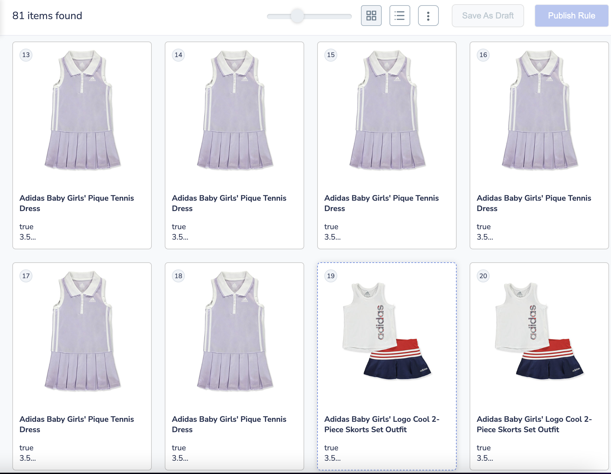

# Pagination
{: .no_toc }

# Table of contents
{: .no_toc .text-delta }

1. TOC
{:toc}

---

# Definition

In e-commerce, pagination refers to the process of dividing search results or product listings into multiple pages, which allows users to navigate through the pages of products. It is used to split large sets of products into smaller, more manageable chunks, which can improve the performance of the website and also user experience.

There are several different types of pagination that can be used in e-commerce, including:

**Fixed Pagination**: This type of pagination is the most common and allows users to navigate through the pages of products by clicking on page numbers or by clicking on the next and previous buttons. The page numbers and buttons are usually displayed at the bottom of the search results or product listings.

**Infinite Scroll**: This type of pagination loads the next set of products automatically as the user scrolls to the bottom of the page, eliminating the need for the user to click on next or page numbers. This type of pagination can be helpful for users that want to quickly browse through a large number of products without having to manually click through pages, but it could also lead to lower engagement and higher bounce rates if not implemented well.

**Click & Scroll**: This type is similar to the infinite scroll pagination, but it includes a "load more" button, so users can load the next set of products at their own discretion. This can be beneficial for users that may want to control the amount of information they see at once and also, it can be helpful for the website to limit the amount of data loaded at once to improve the performance.

It's important to note that the pagination should be consistent, clear, and easy to understand in order to improve the user experience. Also the right pagination method depends on the specific needs of the website and its target audience.


# Behavior

This feature will helps the users to navigate the products for any search/browse request. In many applications the UI for these sorted results are displayed to the user in "pages" containing a fixed number of matching results, and users don’t typically look at results past the first few pages worth of results.

Pagination helps to control the number of products displayed on the page and the type of pagination (infinite scroll, click to scroll, or fixed pagination) to display.


# Pros and Cons 
The choice of pagination method depends on the specific needs of the website and its target audience. However, here are the advantages and disadvantages of different pagination methods.

## Fixed Pagination

**Advantages:**
1. Simple and easy to use
2. Allows users to easily navigate through the pages of products
3. Provides a clear indication of the current page and total number of pages
4. Allows users to go directly to a specific page
   
**Disadvantages:**
1. Users have to manually click through the pages, which can be time-consuming for large product sets
2. May not be suitable for websites with a large number of products
3. Can cause a high bounce rate if users have to navigate too many pages to find what they're looking for

## Infinite Scroll Pagination
**Advantages:**
1. Allows users to quickly browse through a large number of products without having to manually click through pages
2. Can improve the user experience by reducing the number of clicks needed to view all products
3. Can be useful for websites with a large number of products

**Disadvantages:**
1. May not be suitable for users with slow internet connections
2. Some users may find it difficult to track their position within the product set, may lead to lower engagement and higher bounce rate if not implemented well
3. May be difficult for users to find a specific product


## Click & Scroll pagination 
   
**Advantages:**
1. Allows users to control the amount of information they see at once
2. Can be helpful for the website to limit the amount of data loaded at once to improve the performance
3. Can be useful for websites with a large number of products

**Disadvantages:**
1. Users have to manually click through pages
2. May not be suitable for users with slow internet connections
3. May be difficult for users to find a specific product


# Configurations

You can configure the pagination feature by updating the required configs under the “pagination” config object. The following are the various options available under the “pagination” config object:

```js
pagination: {
    // the below pagination configurations goes here
}
```

## enabled
{: .d-inline-block }

Boolean
{: .label }

Required
{: .label .label-red}

"Enabled" is a flag or switch that allows developers to turn on or off a specific feature in an e-commerce website. In this case, the pagination feature will be active and the preferred pagination type will be displayed on the website when the "enabled" flag is turned ON. And, the pagination feature will be disabled when the "enabled" flag is turned OFF.

### Default Value
{: .no_toc }

```js
enabled: true
```

### Scenarios
{: .no_toc }
1. true - selected pagination will be displayed on the website 
2. false - the pagination feature will be disabled


---

## type
{: .d-inline-block }

String
{: .label }

There are 3 types of pagination that can be used:

**Fixed pagination** : In this type of pagination, a set of numbered pages are provided at the bottom of the page, allowing the user to navigate to specific pages. This method is best for desktop devices as it allows for easy navigation through a large number of products. Pass `type: “FIXED_PAGINATION”` to use this type of pagination. See example [here](#usecase-1-fixed-pagination)

**Infinite Scrolling**: In this type of pagination, new items are automatically loaded as the user scrolls to the bottom of the page, allowing the user to seamlessly scroll through all the products. This method is best for mobile devices as it allows for a continuous browsing experience. Pass `type: “INFINITE_SCROLL”` to use this type of pagination. See example [here](#usecase-2-click-and-scroll)

**CLick and scroll**: In this type of pagination, a “Load More” button is provided at the bottom of the page, which when clicked, loads additional products. This method is easy to implement and can be used for both desktop and mobile devices. Pass `type: “CLICK_N_SCROLL”` to use this type of pagination. See example [here](#usecase-3-infinite-scroll)


### Default Value
{: .no_toc }
```js
type: "CLICK_N_SCROLL"
```

### Scenarios
{: .no_toc }

The choice of pagination method depends on the specific needs of the website and its target audience. A fixed pagination with next and previous buttons and numbers is a suitable option for most e-commerce websites. Infinite scroll pagination can work well for mobile devices and for websites with a large number of products and a high volume of traffic. A click and scroll with load more button can be a good option for websites that want to limit the amount of data loaded at once. It’s also important to keep the user experience in mind, as pagination should be intuitive and easy to use for the user.

---

## el
{: .d-inline-block }

Element
{: .label }

Element in which to render the pagination component.

"el" in pagination is an HTML element that is designated to display pagination component. This allows developers to control the placement of the pagination on the webpage and to ensure that they are displayed in a prominent and visible location. The "el" can be set by providing the id or class of the element in the code.

### Default Value
{: .no_toc }

```js
el: null
```

### Scenarios
{: .no_toc }
There are several HTML selectors that can be used to locate the banner element in an e-commerce page. For ex: getElementById, getElementsByClassName, getElementsByTagName, querySelector, querySelectorAll, getElementsByName, etc.

---

## template
{: .d-inline-block }

Function
{: .label }

Customize the look and feel of the pagination by returning your custom HTML string from this function. This function gets 1 parameter: an object that has the pagination information.

This function receives two params:
1. `paginationData` - the list of banners to be displayed
2. `pagination` - the banner configurations

**Expected return value**: a string of HTML that will be used to render the banners on the webpage

### Default Value
{: .no_toc }
```js
template: function (paginationData, pagination) {
    if(!paginationData) {
        return ``;
    }
    const {
        currentPage,
        isNext,
        isPrev,
        noOfPages,
        productsLn,
        numberOfProducts,
        rows
    } = paginationData;
    const {
        pageClass,
        selectedPageClass,
        pageLimit
    } = pagination;
    const {
        UNX_pageNumber
    } = this.testIds;
    if(numberOfProducts <= productsLn) {
        return ``;
    }
    let nextBtn = `<button class="UNX-next-btn UNX-page-next ${pageClass}" data-page-action="next">></button>`;
    let prevBtn = `<button class="UNX-prev-btn UNX-page-prev ${pageClass}" data-page-action="prev"><</button>`;
    let pageNumbers = ``;
    let pages = noOfPages < pageLimit ? noOfPages:pageLimit;
    let startPoint=1;
    let r = Math.ceil(pageLimit/2);
    let point = currentPage - r ;
    if(point > 0 ) {
        startPoint = point;
        pages = currentPage+r;
    }
    const ls = currentPage+r;
    if(ls >= noOfPages){
        const diff = ls-noOfPages;
        startPoint = startPoint-diff;
        if(startPoint<=0) {
            startPoint = 1
        }
        pages = noOfPages;
    }

    for(let i=startPoint;i<=pages;i++) {
        const tId = `${UNX_pageNumber}${i}`
        const pageClassSelected = (i === currentPage) ?selectedPageClass :'';
        pageNumbers += `<button data-test-id="${tId}" data-page-action="paginate" data-page-no="${(i-1)*rows}" class="UNX-page-button ${pageClass} ${pageClassSelected}">${i}</button>`
    }
    if(!isNext) {
        nextBtn = `<button disabled class="UNX-next-btn UNX-page-next">></button>`;
    }
    if(!isPrev) {
        prevBtn = `<button disabled class="UNX-prev-btn UNX-page-prev"><</button>`;
    }
    return [`<div class="UNX-pagination-block">`,
        prevBtn, 
        `<div class="UNX-page-no-block">${pageNumbers}</div>`,
        nextBtn,
    `</div>`].join('');
};

```

**Note:** For the preloader and postloader , position needs to be made absolute , z-index to be -1 . Height of these will be set using what you provide in heightDiffToTriggerNextPage.

### Scenarios
{: .no_toc }
For additional information on custom scenarios, please refer to the [use cases section](#usecases) located below.

---

## pageClass
{: .d-inline-block }

String
{: .label }

CSS class name for the pagination component.

### Default Value
{: .no_toc }
```js
pageClass: "UNX-page-items"
```
### Scenarios
{: .no_toc }

Any valid class name can passed here.

---

## selectedPageClass
{: .d-inline-block }

String
{: .label }

CSS class name for selected page item.

### Default Value
{: .no_toc }
```js
selectedPageClass: "UNX-selected-page-item"
```

### Scenarios
{: .no_toc }

Any valid class name can passed here.

---

## onPaginate
{: .d-inline-block }

Function
{: .label }

`onPaginate` is a callback function that is triggered when the user makes changes to the pagination of a webpage.

This function receives below params:

1. `numberOfProducts`: number of products
2. `start` - the starting index of products, a number
3. `productsLn` - number of products
4. `rows` - the current page size, a number
5. `noOfPages` - total number of pages
6. `currentPage` - current page number
7. `isNext` - does next page exist, a boolean
8. `isPrev` - does previous page exist, a boolean

### Default Value
{: .no_toc }
```js
onPaginate: function(numberOfProducts, start, productsLn, rows, noOfPages, currentPage, isNext, isPrev) {
    // custom code here
}
```

### Scenarios
{: .no_toc }
It is typically used to notify the developer that the pagination has been updated and to take appropriate action, such as updating the displayed data or making an API call to retrieve new data for the current page.

---

## pageLimit
{: .d-inline-block }

Number
{: .label }


`pageLimit` is a parameter that is used when the `type` is set to `FIXED_PAGINATION`. It specifies the number of pages that are to be shown upfront.

### Default Value
{: .no_toc }

```js
pageLimit: 6
```

### Scenarios
{: .no_toc }
Any positive integer can be passed here.

---

## infiniteScrollTriggerEl
{: .d-inline-block }

Element
{: .label }

An infinite scroll trigger element, or `infiniteScrollTriggerEl`, is an HTML element that is used to detect when a user has reached the boundary of a page when using infinite scrolling. This allows for a seamless browsing experience where new content is loaded automatically as the user scrolls, rather than requiring them to manually navigate to a new page. The `type` must be set to `INFINITE_SCROLL` for the trigger to work.


### Default Value
{: .no_toc }

```js
infiniteScrollTriggerEl: window
```

### Scenarios
{: .no_toc }
Any valid HTML selector can be used to select the trigger

---

## heightDiffToTriggerNextPage
{: .d-inline-block }

Number
{: .label }

`heightDiffToTriggerNextPage` is a parameter that is used when the type is set to INFINITE_SCROLL. It specifies the distance from the bottom of the page (measured in pixels) that needs to be reached before the next page of content is loaded. 

For example, if `heightDiffToTriggerNextPage` is set to 100, this means that when the user scrolls to within 100 pixels of the bottom of the page, the next page of content will be loaded. This parameter allows for control over when the next page is loaded and can be adjusted depending on the desired user experience and the amount of content that is being loaded. In case of infinite scroll pagination, two elements with classnames `pre-loader` and `post-loader` are added before and after products container, whose height is set to `heightDiffToTriggerNextPage` in pixels. 

Please make sure the CSS for .UNX-pre-loader and .UNX-post-loader is containing position:absolute, width:100% and z-index: -1, to ensure these components are hidden.

Note:
- Setting the `heightDiffToTriggerNextPage` number to very high (>300 or >400) would trigger the next/previous page APIs more often than required and would lead to crashing the application. Any value set more than 1000 will get capped at 1000.


### Default Value
{: .no_toc }

```js
heightDiffToTriggerNextPage: 100
```

### Scenarios
{: .no_toc }
Any positive integer can be passed to `heightDiffToTriggerNextPage`

---


<!-- ## virtualization
{: .d-inline-block }

Boolean
{: .label }

In our e-commerce product listing environment, we introduce the concept of product virtualization, providing a dynamic approach to managing the display of products on a webpage. Within this system, there is a parameter called bufferPages, represented as an integer. When set to 1, the SDK employs prefetching, ensuring that one page of products is maintained ahead and behind the currently displayed page.

By introducing virtualization and providing the flexibility to choose between virtualization and full product rendering, our system aims to keep the DOM lightweight, ensuring a faster and more efficient browsing experience, especially on mobile devices. This design mitigates the common issue of page slowdown caused by continuously fetching and populating more products as users scroll through the listing.

**Performance Benefits:**

1) **Optimized DOM:** Virtualization keeps the Document Object Model lightweight, leading to faster load times and reduced memory usage in the browser.

2) **Efficient Scrolling:** By fetching only the necessary products as users scroll, the system prevents the common issue of page slowdown caused by excessive product loading.

{: .important }
> Note: The virtualization feature is available only for the Infinite Scroll pagination and in the SDK versions v2.1.2 and beyond.

### Default Value
{: .no_toc }

```js
virtualization: true
```

### Scenarios
{: .no_toc }
- **true:** When the flag is set to true, only virtualization occurs. This means that only the products belonging to the current page and the buffer pages before and after the current page are rendered on the DOM (Document Object Model). This significantly reduces the number of products loaded onto the page, optimizing performance and memory consumption in the user's browser.
- **false:** Conversely, if the virtualization flag is set to false, all products are loaded onto the DOM as-is. This approach allows for a more traditional rendering of all products, which might be beneficial in certain scenarios.


---

## bufferPages
{: .d-inline-block }

Number
{: .label }

The introduction of the bufferPages parameter allows for intelligent prefetching. When set to 1, the SDK employs prefetching, ensuring that one page of products is maintained ahead and behind the currently displayed page.

{: .important }
> Note: The bufferPages feature is available only for the Infinite scroll pagination and in the SDK versions v2.1.2 and beyond.


### Default Value
{: .no_toc }

```js
bufferPages: 1
```

### Scenarios
{: .no_toc }
Any positive integer can be set here. -->


## action
{: .d-inline-block }

String
{: .label }

Action on which pagination should trigger: “click” or “change”.

### Default Value
{: .no_toc }

```js
action: 'click'	
```

### Scenarios
{: .no_toc }

1. `Click`: Click refers to a user interaction where a user clicks on a specific button or interface element to initiate a pagination.
2. `Change`: Change refers to a pagination operation that is initiated when a specific variable or data element is changed

---


## tagName
{: .d-inline-block }

String
{: .label }

"tagName" refers to the name of an HTML tag used to wrap or structure the content (pagination) on a webpage.

### Default Value
{: .no_toc }

```js
tagName: 'div'
```

### Scenarios
{: .no_toc }
Any valid html tag such as div, span, p, h1, h2, etc in which you like the banner code to be wrapped in.

---

## htmlAttributes
{: .d-inline-block }

Object
{: .label }

"htmlAttributes" refers to a set of key-value pairs that provide additional information or properties for an HTML element. By default it contains classes for the wrapper. You can add more classes or any valid attributes.

### Default Value
{: .no_toc }
```js
htmlAttributes: { class:"UNX-banner-block" }
```

### Scenarios
{: .no_toc }
Any valid html attribute can be passed as `key : value` pairs inside an object.

--- 

# Data actions

## data-page-action
Actions below are needed to be set as `data-page-action`.

1. `prev` - This action is needed on the button on click of which it triggers an api call for previous page.
2. `next` - This action is needed on the button on click of which it triggers an api call for next page. 
3. `firstPage` - This action is needed on the button on click of which it triggers an api call for the very first page.
4. `lastPage` - This action is needed on the button on click of which it triggers an api call for the last page.
5. `paginate` - This action is needed on page number buttons.(In case of fixed pagination)

---
# Things To Know for Infinite scroll

1. Setting the heightDiffToTriggerNextPage number to very high (>300 or >400) would trigger the next/previous page APIs more often than required and would lead to crashing the application. Any value set more than 1000 will get capped at 1000.
2. Please make sure the CSS for .UNX-pre-loader and .UNX-post-loader is containing position:absolute, width:100% and z-index: -1, to ensure these components are hidden.The parent container of .UNX-pre-loader and .UNX-post-loader should have `position:relative`.
3. The height css for the postloader and preloader should not be modified . Instead pass it in `heightDiffToTriggerNextPage`
4. Parent of pre-loader and post-loader needs to be top to bottom aligned.
5. The height and width attributes should be specified for every product image. If these attributes are not set, it can cause content reflow issues. When the image hasn't loaded yet and the height is not defined, the content may not be positioned correctly, making the post-loader visible and resulting in multiple API calls being triggered simultaneously.

**Note:** If the above mentioned points are not followed it can lead to multiple or no api calls.


---
# UseCases
## Usecase 1: Fixed Pagination
[](https://unbxd.com/docs/wp-content/uploads/2020/05/traditional-pagination.png)

```js
pagination : {
  enabled:true,
  el: document.getElementById("clickScrollContainer"),
  template:function (paginationData, pagination) {
    if(!paginationData) {
        return ``;
    }
    const {
        currentPage,
        isNext,
        isPrev,
        noOfPages,
        productsLn,
        numberOfProducts,
        rows
    } = paginationData;
    const {
        pageClass,
        selectedPageClass,
        pageLimit
    } = pagination;
    const {
        UNX_pageNumber
    } = this.testIds;
    if(numberOfProducts <= productsLn) {
        return ``;
    }
    let nextBtn = `<button class="UNX-next-btn UNX-page-next ${pageClass}" data-page-action="next">></button>`;
    let prevBtn = `<button class="UNX-prev-btn UNX-page-prev ${pageClass}" data-page-action="prev"><</button>`;
    let pageNumbers = ``;
    let pages = noOfPages < pageLimit ? noOfPages:pageLimit;
    let startPoint=1;
    let r = Math.ceil(pageLimit/2);
    let point = currentPage - r ;
    if(point > 0 ) {
        startPoint = point;
        pages = currentPage+r;
    }
    const ls = currentPage+r;
    if(ls >= noOfPages){
        const diff = ls-noOfPages;
        startPoint = startPoint-diff;
        if(startPoint<=0) {
            startPoint = 1
        }
        pages = noOfPages;
    }

    for(let i=startPoint;i<=pages;i++) {
        const tId = `${UNX_pageNumber}${i}`
        const pageClassSelected = (i === currentPage) ?selectedPageClass :'';
        pageNumbers += `<button data-test-id="${tId}" data-page-action="paginate" data-page-no="${(i-1)*rows}" class="UNX-page-button ${pageClass} ${pageClassSelected}">${i}</button>`
    }
    if(!isNext) {
        nextBtn = `<button disabled class="UNX-next-btn UNX-page-next">></button>`;
    }
    if(!isPrev) {
        prevBtn = `<button disabled class="UNX-prev-btn UNX-page-prev"><</button>`;
    }
    return [`<div class="UNX-pagination-block">`,
        prevBtn,
        `<div class="UNX-page-no-block">${pageNumbers}</div>`,
        nextBtn,
    `</div>`].join('');
  },
  pageClass:"UNX-page-items",
  selectedPageClass:"UNX-selected-page-item",
  type:'FIXED_PAGINATION', // INFINITE_SCROLL or CLICK_N_SCROLL or FIXED_PAGINATION
  onPaginate:function(paginationInfo){},
  action:'click',
  pageLimit:6
}
```

## Usecase 2: Click and Scroll

[](https://unbxd.com/docs/wp-content/uploads/2020/05/click-and-scroll.png)

```js
pagination: {
  el: document.getElementById("clickScrollContainer"),
  type:'CLICK_N_SCROLL',
  action:'click',
  template:function(pageData, pagination) {
    const {
        pageClass
    } = pagination;
    return `<div class="UNX-click-scroll"><button data-test-id="${this.testIds.UNX_loadMore}" class="UNX-click-n-scroll ${pageClass}">Load More</button></div>`
  }
}
```

## Usecase 3: Infinite Scroll

[](../assets/infinitescroll.png)
```js
pagination: {
  type:'INFINITE_SCROLL',
  infiniteScrollTriggerEl: window, 
  heightDiffToTriggerNextPage: 100, 
}
```

## Usecase 4: Fixed Pagination with first and last page buttons

```js

pagination: {
    enabled:true,
    el: document.getElementById("clickScrollContainer"),
    template: function (paginationData, pagination) {
    if(!paginationData) {
        return ``;
    }
    const {
        currentPage,
        isNext,
        isPrev,
        noOfPages,
        productsLn,
        numberOfProducts,
        rows
    } = paginationData || {};
    const {
        pageClass,
        selectedPageClass,
        pageLimit
    } = pagination || {};
    const {
        UNX_pageNumber = ""
    } = this.testIds;
    if(numberOfProducts <= productsLn) {
        return ``;
    }
    let nextBtn = `<button class="UNX-next-btn UNX-page-next ${pageClass}" data-page-no="${(currentPage)*rows}" data-page-action="next">></button>`;
    let prevBtn = `<button class="UNX-prev-btn UNX-page-prev ${pageClass}" data-page-no="${(currentPage-2)*rows}" data-page-action="prev"><</button>`;
    
    let firstPageBtn = `<button class="UNX-prev-btn UNX-page-next ${pageClass}"  data-page-action="firstPage"><<</button>`;
    let lastPageBtn = `<button class="UNX-prev-btn UNX-page-prev ${pageClass}"  data-page-action="lastPage">>></button>`;
    
    let pageNumbers = ``;
    let pages = noOfPages < pageLimit ? noOfPages:pageLimit;
    let startPoint=1;
    let r = Math.ceil(pageLimit/2);
    let point = currentPage - r ;
    if(point > 0 ) {
        startPoint = point;
        pages = currentPage+r;
    }
    const ls = currentPage+r;
    if(ls >= noOfPages){
        const diff = ls-noOfPages;
        startPoint = startPoint-diff;
        if(startPoint<=0) {
            startPoint = 1
        }
        pages = noOfPages;
    }

    for(let i=startPoint;i<=pages;i++) {
        const tId = `${UNX_pageNumber}${i}`
        const pageClassSelected = (i === currentPage) ?selectedPageClass :'';
        pageNumbers += `<button data-test-id="${tId}" data-page-action="paginate" data-page-no="${(i-1)*rows}" class="UNX-page-button ${pageClass} ${pageClassSelected}">${i}</button>`
    }
    if(!isNext) {
        nextBtn = `<button disabled class="UNX-next-btn UNX-page-next">></button>`;
    }
    if(!isPrev) {
        prevBtn = `<button disabled class="UNX-prev-btn UNX-page-prev"><</button>`;
    }
    return [`<div class="UNX-pagination-block">`,
        firstPageBtn,
        prevBtn, 
        `<div class="UNX-page-no-block">${pageNumbers}</div>`,
        nextBtn,
        lastPageBtn,
    `</div>`].join('');
};
}
```

---

# FAQs

1. [What is list view and grid view in product listing page?](../Faqs#pagination-related-queries)
2. [What is the best pagination method for my website?](../Faqs#what-is-the-best-pagination-method-for-my-website)
3. [What are the advantages and disadvantages of Fixed Pagination](../Faqs#what-are-the-advantages-and-disadvantages-of-fixed-pagination)
4. [What are the advantages and disadvantages of Infinite Scroll Pagination](#what-are-the-advantages-and-disadvantages-of-infinite-scroll-pagination)
5. [What are the advantages and disadvantages of Click & Scroll pagination (with load more button)](../Faqs#what-are-the-advantages-and-disadvantages-of-click--scroll-pagination-with-load-more-button)
6.[Can I customize the appearance of the pagination controls?](../Faqs#can-i-customize-the-appearance-of-the-pagination-controls)