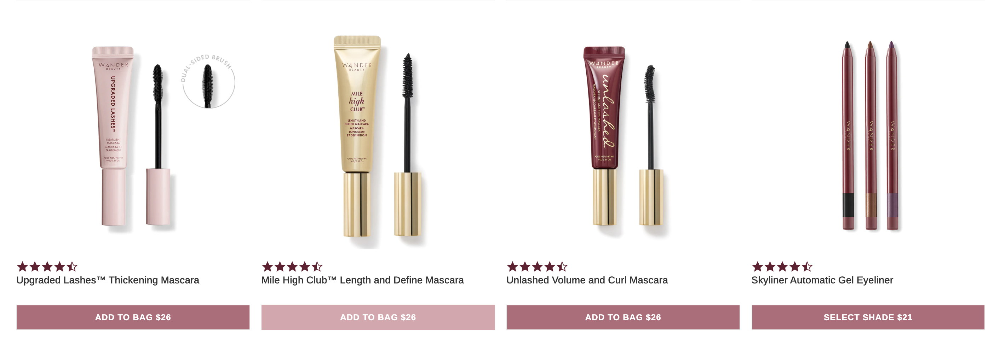
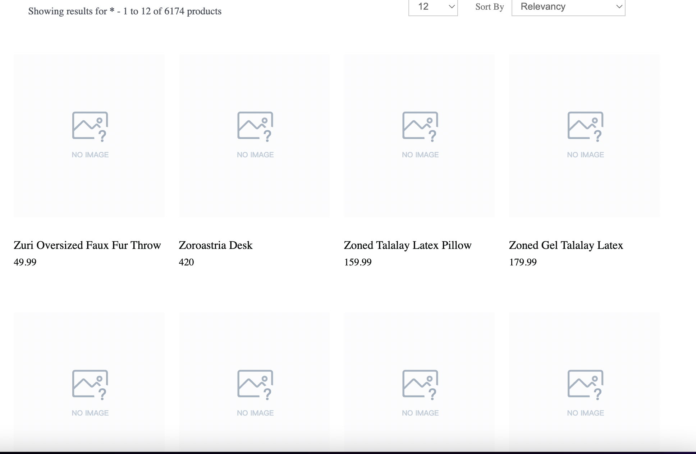
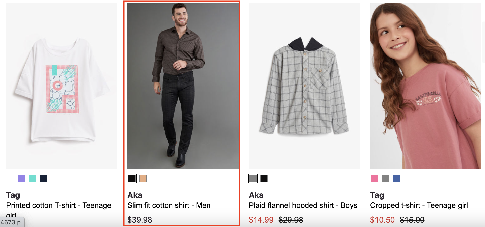

# Products
{: .no_toc }

# Table of contents
{: .no_toc .text-delta }

1. TOC
{:toc}

---

# Definition
In e-commerce, "products" refer to the items that are available for purchase on an online store. These can be physical goods, such as clothing, electronics, or furniture, or digital goods, such as software, music, or video content. 

An e-commerce website typically includes a catalog of products, which can be searched, filtered, and sorted by various criteria such as product category, brand, price, and more. Each product typically has a detailed page that includes information such as a product image, name, description, price, and available options such as size, color, or material.

The products are usually grouped into categories, like for example clothing, electronics, and home decor, which helps users to easily find the products they are looking for. Additionally, each product can also be associated with multiple tags and attributes that can be used for searching, filtering, and sorting the products.

The availability of a wide range of products and the ability to easily find and compare them is a key factor in the success of an e-commerce website, as it helps to attract and retain customers, and ultimately drive sales.

# Behavior

This is the place where products from the search results will be rendered. The template function receives each product object and its position as second argument.

[](https://unbxd.com/docs/wp-content/uploads/2020/05/search-result-render.png)

# Configurations

The following are the various options available under the “products” config object:

```js
products: {
    // the below product configurations goes here
}
```

## productType
{: .d-inline-block }

String
{: .label }

Used to indicate if the page is search or category. Possible values: search (or) category. “search” -> the search term in the url is used by library. “category”-> the getCategoryID function will be invoked to identify the category which needs to be displayed for the given url.


### Default Value
{: .no_toc }
``` js
productType:"SEARCH"
```
### Scenarios
{: .no_toc }

Unbxd has two product offerings:
1. `SEARCH`: Powers search results pages.
2. `BROWSE or CATEGORY`: Powers category listing pages.

---
## el
{: .d-inline-block }

Element
{: .label  }

Required
{: .label  .label-red}

"el" in products is an HTML element that is designated to display products or advertisements. This allows developers to control the placement of the products on the webpage and to ensure that they are displayed in a prominent and visible location. The "el" can be set by providing the id or class of the element in the code.

### Default Value
{: .no_toc }

```js
el: null
```

### Scenarios
{: .no_toc }
There are several HTML selectors that can be used to locate the product element in an e-commerce page. For ex: getElementById, getElementsByClassName, getElementsByTagName, querySelector, querySelectorAll, getElementsByName, etc.

---
## template
{: .d-inline-block }

Function
{: .label }

The "template" function here refers to the ability to change the appearance of the product feature on the e-commerce website. It allows developers to control the appearance of the products by providing custom HTML. The function receives  5 parameters: complete product object and index of the current product, swatches, selected view type, product config.

This function passes two params:
1. `product` - it is object which contains data related to product like : unxTitle,unxImageUrl,uniqueId,unxStrikePrice,unxPrice,unxDescription etc.
2. `idx` - it is index of product.
3. `swatchUI` - it is swatchUI object which has info related swatchui like: btnList and btnList.
4. `productViewType` - Its value might either be "GRID" or "LIST".
5. `products` - its contains common info related to products like :productItemClass,defaultImage.

**Expected return value**: a string of HTML that will be used to render the products on the webpage


### Default Value
{: .no_toc }
``` js
template:function(product,idx,swatchUI,productViewType,products ){
    const {
        unxTitle,
        unxImageUrl,
        uniqueId,
        unxStrikePrice,
        unxPrice,
        unxDescription
    } = product; 
    const {
        productItemClass,
        defaultImage
    }  = products;
    let imgUrl = Array.isArray(unxImageUrl) ? unxImageUrl[0]:unxImageUrl;
    if(!imgUrl) {
        imgUrl = defaultImage;
    }
    let imagesUI = `<div class="UNX-img-wrapper"></div>`;
    const priceUI = `<span class="UNX-sale-price">${unxPrice}</span>`;
    let strikeUi = ``;
    if(unxStrikePrice) {
        strikeUi = `<span class="UNX-strike-price">${unxStrikePrice}<span>`
    }
    let cardType = ``;
    let descUI = ``;
    if(productViewType === "GRID") {
        cardType = "UNX-grid-card"
    } else {
        cardType = "UNX-list-card";
        descUI = `<p class="UNX-description">${unxDescription}</p>`;
    }
    let swatchBtnUI = ``;
    const {
        btnList,
        imgList 
    } = swatchUI || {};
    if(btnList) {
        swatchBtnUI = `<div class="UNX-swatch-wrapper">${btnList}</div>`;
    }
    if(imgList) {
        imagesUI = imgList; 
    }
    return [`<div id="${uniqueId}" data-id="${uniqueId}" data-prank="${idx}" data-item="product" class="UNX-product-col ${cardType} ${productItemClass}">`,,
                `<div class="UNX-images-block">${imagesUI}</div>`,
                `<div class="UNX-product-content">`,
                    `<h3 class="UNX-product-title">${unxTitle}</h3>`,
                    swatchBtnUI,
                    descUI,
                    `<div class="UNX-price-row">${priceUI} ${strikeUi}</div>`,
                `</div>`,
            `</div>`].join('')
};
```

### Scenarios
{: .no_toc }

For additional information on custom scenarios, please refer to the [use cases section](#usecases) located below.

---
## productAttributes
{: .d-inline-block }

Array
{: .label }

This is an array of all required fields for generating the result template. This is helpful to load the results faster.

These are some specific product attributes commonly used in e-commerce:

1. `title`: the name or description of the product.
2. `uniqueId`: a unique identifier for the product, different from the SKU.
3. `price`: the original price of the product.
4. `sku`: a unique identifier for the product.
5. `imageUrl`: the URL of the image representing the product.
6. `displayPrice`: the price of the product that is displayed to the customer.
7. `salePrice`: the reduced price of the product during a sale.
8. `sortPrice`: the price used for sorting products, which may be different from the display price.
9. `productDescription`: a detailed explanation of the product and its features.
10. `unbxd_color_mapping`: a mapping of the product color to a standardized color.
11. `colorName`: the name of the product color.
12. `color`: the color of the product.

These attributes are used to provide customers with detailed information about the product and to help them make informed purchasing decisions. The information provided by these attributes is usually displayed on the product page and used in search and filtering functions.

### Default Value
{: .no_toc }

```js
productAttributes:["title", "uniqueId", "price", "sku", "imageUrl", "displayPrice", "salePrice", "sortPrice", "productDescription", "unbxd_color_mapping", "colorName", "color"]
```


---
## attributesMap
{: .d-inline-block }

Object
{: .label }

Field mappings for the data to be displayed in the product card.
The "attributesMap" you provided is a mapping of attribute names used to standardized attribute names. The mapping is used to ensure consistent and standardized data across different systems and services.

1. "unxTitle" maps to "title".
2. "unxImageUrl" maps to "imageUrl".
3. "unxPrice" maps to "salePrice".
4. "unxStrikePrice" maps to "displayPrice".
5. "unxId" maps to "uniqueId".
6. "unxDescription" maps to "productDescription".

This mapping can be used in data processing, data analysis, or integration with other systems to ensure consistent and standardized data handling and processing

### Default Value
{: .no_toc }

```js
attributesMap:{"unxTitle": "title","unxImageUrl": "imageUrl","unxPrice": "salePrice","unxStrikePrice": "displayPrice","unxId": "uniqueId","unxDescription": "productDescription"}
```

---
## gridCount
{: .d-inline-block }

Number
{: .label }

If you want to have grid type user interface, then you can configure how many columns you want to have in a row with this config. By default it will adjust according to screen size.

### Default Value
{: .no_toc }
Adjusts as per screen size.

---
## productItemClass
{: .d-inline-block }

String
{: .label }

Additional class name to be added to each product card.

### Default Value
{: .no_toc }

```js
productItemClass:“product-item”
```

### Scenarios
{: .no_toc }

Any valid class name can passed here.

---
## onProductClick
{: .d-inline-block }

Function
{: .label }

Callback functions called on click of a product card. This function gets the product object & the event object as params.
Note: The `data-id` field has to be set in the template to receive this product information (as shown in the default template here), else it will return `null` by default

This function passes two params:

1. `product` : this will contain the product data like uniqueId etc. Note: The `data-id` field has to be set in the template to receive this product information (as shown in the default template here), else it will return `null` by default

2. `event` : it take any javascript event as input .

### Default Value
{: .no_toc }

```js
onProductClick:function(product, event) {}	
```

---
## defaultImage
{: .d-inline-block }

String
{: .label }

If product doesnt contain image url, by default this image will be shown

### Default Value
{: .no_toc }

``` js
defaultImage:"https://libraries.unbxdapi.com/sdk-assets/defaultImage.svg"
```

### Scenarios
{: .no_toc }
Any valid image url you can add here in defaultImage.

---
## tagName
{: .d-inline-block }

String
{: .label }

"tagName" refers to the name of an HTML tag used to wrap or structure the content (product) on a webpage.

### Default Value
{: .no_toc }

```js
tagName: 'div'
```

### Scenarios
{: .no_toc }
Any valid html tag such as div, span, p, h1, h2, etc in which you like the product code to be wrapped in.

---
## htmlAttributes
{: .d-inline-block }

Object
{: .label }

"htmlAttributes" refers to a set of key-value pairs that provide additional information or properties for an HTML element. By default it contains classes for the wrapper. You can add more classes or any valid attributes.

### Default Value
{: .no_toc }

```js
htmlAttributes:{class:"UNX-search-results-block UNX-result-wrapper"}
```

### Scenarios
{: .no_toc }
Any valid html attribute can be passed as `key : value` pairs inside an object.

---


# UseCases
## Usecase 1: Default Example

Sample “products” config:
[](../assets/products.png)

```js
products: {
        el: document.getElementById("searchResultsWrapper"),
        productAttributes: templateUtils.getMappedFields(),
        onProductClick: templateUtils.onProductClick,
        attributesMap: window.UNBXD_MAPPED_FIELDS,
        template: function (product, idx, swatchUI, productViewType, products) {
          let { uniqueId, imageUrl, title, price, sellingPrice } = product;
          const { productItemClass } = products;

          let imgUrl = Array.isArray(imageUrl) ? imageUrl[0] : imageUrl;
          imgUrl = imgUrl ? imgUrl.trim() || DEFAULT_IMAGE : DEFAULT_IMAGE;
          if (!window.UNBXD_MAPPED_FIELDS["imageUrl"]) {
            imgUrl = DEFAULT_IMAGE;
          }

          let imagesUI = `<div class="UNX-img-wrapper  UNX-parent-image"></div>`;

          const variantData = templateUtils.getVariantsUi(
            product,
            imagesUI,
            SWATCH_LIMIT,
            DEFAULT_IMAGE
          );
          let vImages = variantData.vImages;
          imagesUI = variantData.imagesUI;
          const priceHtml = templateUtils.getDisplayPriceRow(
            price,
            sellingPrice
          );
          let priceUI = `<div class="UNX-price-row">${priceHtml}</div>`;
          let cardType = ``;
          if (productViewType === "GRID") {
            cardType = "UNX-grid-card";
          } else {
            cardType = "UNX-list-card";
          }
          /** DELETE_STARTS */
          let debuggerUI = window.UNBXD_USER
            ? `<span class="UNX-preview-debugger" data-title="${title}" data-unique-id="${uniqueId}"></span>`
            : "";

          let { pins, slots = [] } =
            window?.unbxdSearch?.state?.responseObj.debug?.metadata;
          let slotarr = [];

          for (let i = 0; i < slots.length; i++) {
            for (let j = slots[i].start; j <= slots[i].end; j++) {
              slotarr.push(j);
            }
          }

          /** DELETE_ENDS */

          return [
            `<div id="pid_${uniqueId}" data-id="${uniqueId}" data-prank="${idx}" data-item="product" class="UNX-product-col ${cardType} ${productItemClass} pd_pid_${uniqueId}">`,
            `<div class="UNX-images-block">`,
            // templateUtils.favouriteButton(uniqueId),
            `${/* DELETE_STARTS */ ""}
                                      ${debuggerUI}
                                      ${/* DELETE_ENDS */ ""}`,
            imagesUI,
            vImages,
            `<div class="index-badge">
                ${idx}
              </div>`,
            `<div class=${pins && pins[uniqueId] && "pin-box"}>`,
            `<div class=${pins && pins[uniqueId] && "pin-icon"}>`,
            `</div>`,
            `</div>`,
            `<div class=${slotarr.includes(idx) && "slot-box"}>`,
            `<div class=${slotarr.includes(idx) && "slot-icon"}>`,
            `</div>`,
            `</div>`,

            `</div>`,
            `<div class="UNX-product-content">`,
            `<h3 class="UNX-product-title" title="${title}">${
              title || uniqueId || ""
            }</h3>`,
            priceUI,

            `</div>`,

            `</div>`,
          ].join("");
        },
}
```

## Usecase 2: With Default Image

### User requirment
When an image url is mismapped or when an image is missing.
By mistake, so you can add any image as default image.


[](../assets/default-image-product.png)
```js
products:{
   // ...other confiurations goes here
  defaultImage:"https://libraries.unbxdapi.com/sdk-assets/defaultImage.svg"
}
```

## Usercase 3: With swatches

## User requirment
Swatches are commonly used to display the available colors of a product, such as clothing or home decor, allowing the users to see a visual representation of the options before they purchase

[](../assets/product-swatches.png)