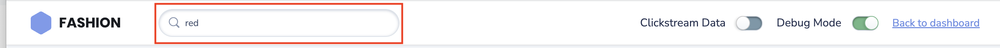

# Search Box
{: .no_toc }

# Table of contents
{: .no_toc .text-delta }

1. TOC
{:toc}

---

# Definition
A search bar in an e-commerce page is a user interface element that allows users to quickly and easily search for specific products within an online store's catalog. It typically appears at the top of an e-commerce website's home page, and is often prominently displayed in a larger font and contrasting color to make it easy for users to find.


# Behavior
When a user enters a search term into the bar and hits the enter key or clicks the search button, the system will conduct a search of the online store's catalog and return a list of products that match the search term. The results are usually presented in a list format, with a thumbnail image of each product, its name, and its price.

Search bar feature can include an autocomplete functionality which suggest or dropdown the matching keywords, or it may also include advanced search functionality that allows users to filter their results by various criteria such as product category, brand, price range, and more.

The search bar is an important tool for e-commerce websites as it allows users to easily find the products they are looking for and help to increase the chance of them making a purchase.

# Configurations

The following two configurations are used by the library to bind keyboard and mouse events to the search input field and search button on your website.

## searchBoxEl
{: .d-inline-block }

Element
{: .label }

Configure the search input element on which to listen to search query changes.

### Default Value
{: .no_toc }

``` js
searchBoxEl : null
```
### Scenarios
{: .no_toc }
``` js
searchBoxEl: document.getElementById("unbxdInput")
```

---
## searchButtonEl
{: .d-inline-block }

Element
{: .label }

Configure your search button here. Clicking on this will load the results based the input value provided in “searchBoxEl".
### Default Value
{: .no_toc }
``` js
searchButtonEl : NA
```

### Scenarios
{: .no_toc }
``` js
searchButtonEl: document.getElementById("searchBtn")
```

---

# Default Example

[](../assets/searchbox.png)

```js
<div class="UNX-input-wrapper">
  <input id="unbxdInput" class="UNX-input" type="text"/>
  <button id="searchBtn" class="fa fa-search"></button>
</div>
```

At the end of this step, you should have configured the “input” & “search button” as shown below:

```js
window.unbxdSearch = new UnbxdSearch({
  siteKey: "<your site key>",
  apiKey: "<your API key>",
  searchBoxEl: document.getElementById("unbxdInput"),
  searchButtonEl: document.getElementById("searchBtn"),
});
```

# UseCases
## Usecase 1:
## Usecase 2:
## Usecase 3:
