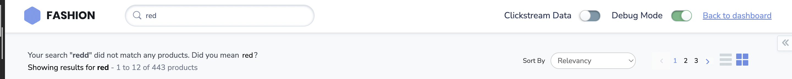

# Spell Check
{: .no_toc }

# Table of contents
{: .no_toc .text-delta }

1. TOC
{:toc}

---
# Definition
In an e-commerce platform, 'spell check' feature refers to a functionality that helps users to find products even if they have made a spelling mistake when searching for them.

This feature utilizes natural language processing (NLP) and machine learning algorithms to automatically detect and correct spelling errors in the user's search query. When a user enters a search term that contains a spelling mistake, the system will automatically check the spelling of the term against a dictionary of correctly spelled words. If the system detects a spelling mistake, it will try to suggest the correct spelling and show the search results based on that correction.

For example, if a user types in "iphone11" instead of "iPhone 11", the system will recognize the mistake and correct the spelling, displaying the search results for "iPhone 11".

This feature can help to improve the user experience by reducing the chances of users entering search terms that do not match any products in the online store's catalog and also increase the accuracy of search results.

Additionally, by using machine learning models, the spell check feature can improve its performance over time, becoming better at recognizing and correcting spelling errors. This can help to increase the chances of users finding the products they are looking for, even if they make a spelling mistake.

# Behavior

The spell check feature provides **spelling suggestions** or **spell-checks** for misspelled search queries.

[](https://unbxd.com/docs/wp-content/uploads/2020/05/spellcheck-1.png)

In such cases, the context-aware algorithm of Unbxd understands your visitor’s intent and sends a “**Did You Mean**” response along with a search result set for the query, if any.

# Configurations

You can configure the spellcheck feature by updating the required configs under the “spellCheck” config object.

``` js
spellCheck: {
      // the below spellcheck configurations goes here.
}
```

## enabled
{: .d-inline-block }

Boolean
{: .label }
Required
{: .label .label-red }

“Enabled” is a flag or switch that allows developers to turn on or off a specific feature in an e-commerce website. In this context, the “spellcheck feature” refers to the ability to display spellcheck on the website.

When the “enabled” flag is turned on, the spellcheck feature will be active,This can be used to help result even when you write incorrect query. When the “enabled” flag is turned off, the spellcheck feature will be disabled.
### Default Value
{: .no_toc }
```js
enabled: false
```

### Scenarios
{: .no_toc }
1. `true`  - Spellcheck feature will be enabled.
2. `false` - Spellcheck feature will be disabled.

---
## el	
{: .d-inline-block }

Element
{: .label }
Required
{: .label .label-red }

“el” is an HTML element in an e-commerce page that is designated to display spellcheck component. This allows developers to control the placement of the spellcheck component on the webpage and to ensure that they are displayed in a prominent and visible location. The “el” can be set by providing the id or class of the element in the code.

Element in which to render the spellcheck component.
### Default Value
{: .no_toc }
```js
el: null
```

### Scenarios
{: .no_toc }
There are several HTML selectors that can be used to locate the banner element in an e-commerce page. For ex: getElementById, getElementsByClassName, getElementsByTagName, querySelector, querySelectorAll, getElementsByName, etc.


---
## template	
{: .d-inline-block }

Function
{: .label }

The “template” function here refers to the ability to change the appearance of the spellcheck feature on the e-commerce website. It allows developers to control the appearance of the spellcheck component by providing custom HTML.

This function takes three params:
1. `query` - the search query , which generally refers to a request made by a user to search for specific products or information within the app.
2. `suggestion` - the suggested query text.
3. `pages` - It is a config object with product count details ({start, productsLn, numberOfProducts}).

**Expected return value**: a string of HTML that will be used to render the spellcheck component on the webpage

### Default Value
{: .no_toc }
```js
template: function(query,suggestion,pages) {
    const {
        start,
        productsLn,
        numberOfProducts
    } = pages;
    const {
        selectorClass,
        enabled
    } = this.options.spellCheck;
    const {
        productType
    } = this.options;
    let newQuery = query;
    if(productType !=="SEARCH" ) {
        const catId = this.getCategoryId() || "";
        const cId = decodeURIComponent(catId).split(">");
        newQuery = cId[cId.length-1] || cId[0] ;
    }
    const {
        UNX_spellCheck
    } = this.testIds
    const noUi = (suggestion) ? `<p class="UNX-no-result"> Your search "<strong>${suggestion}</strong>" did not match any products. Did you mean <button data-test-id="${UNX_spellCheck}" data-action="getSuggestion" class="${selectorClass}">${query}</button>? </p>` :``;
    let qUi = ``;
    let countUi = ``;
    if(numberOfProducts > 0) {
        countUi = `<span class="UNX-result-info">  -  ${start+1} to ${productsLn+start} of ${numberOfProducts} products</span>`;
    }
    if(pages && newQuery){
        if(!enabled) {
            newQuery = suggestion || query
        }
        qUi = `<p class="UNX-suggestion-p">Showing results for <strong>${newQuery}</strong> ${countUi}</p>`;
    }
    return  [`<div class="UNX-spellcheck-block">`,
            noUi,
            qUi,
        `</div>`].join('');
}
```
### Scenarios
{: .no_toc }
For additional information on custom scenarios, please refer to the [use cases section](#usecases) located below.

---

## selectorClass
{: .d-inline-block }

String
{: .label }

Additional CSS class name for the spell check component,a selector class is typically a specific class or group of classes that are used to select spellcheck component.

### Default Value
{: .no_toc }
```js
selectorClass:"UNX-suggestion"
```

### Scenarios

Any valid class name can passed here.

---

## tagName
{: .d-inline-block }

String
{: .label }

"tagName" refers to the name of an HTML tag used to wrap or structure the content (spellcheck) on a webpage.

### Default Value
{: .no_toc }

```js
tagName: 'DIV'
```

### Scenarios
{: .no_toc }
Any valid html tag such as div, span, p, h1, h2, etc in which you like the spellcheck code to be wrapped in.

---
## htmlAttributes
{: .d-inline-block }

Object
{: .label }

"htmlAttributes" refers to a set of key-value pairs that provide additional information or properties for an HTML element. By default it contains classes for the wrapper. You can add more classes or any valid attributes.

### Default Value
{: .no_toc }
```js
htmlAttributes: { class:"UNX-spellcheck-wrapper" }
```

### Scenarios
{: .no_toc }
Any valid html attribute can be passed as `key : value` pairs inside an object.

---
# Usecases

## Usecase 1: 
### Default Example
Sample “spellCheck” config

[](../assets/spellcheck.png)

```js
spellCheck:{
    enabled:true,
    el:document.getElementById("didYouMeanWrapper"),
    selectorClass: "UNX-suggestion",
    template: function(query,suggestion,pages) {
    const {
        start,
        productsLn,
        numberOfProducts
    } = pages;
    const {
        selectorClass
    } = this.options.spellCheck;
    const {
        productType
    } = this.options;
    let newQuery = query;
    if(productType !=="SEARCH" ) {
        const catId = this.getCategoryId() || "";
        const cId = decodeURIComponent(catId).split(">");
        newQuery = cId[cId.length-1] || cId[0] ;
    }
    const {
        UNX_spellCheck
    } = this.testIds
    const noUi = (suggestion) ? `<p class="UNX-no-result"> Your search "<strong>${suggestion}</strong>" did not match any products. Did you mean <button data-test-id="${UNX_spellCheck}" data-action="getSuggestion" class="${selectorClass}">${query}</button>? </p>` :``;
    let qUi = ``;
    let countUi = ``;
    if(numberOfProducts > 0) {
        countUi = `<span class="UNX-result-info">  -  ${start+1} to ${productsLn+start} of ${numberOfProducts} products</span>`;
    }
    if(pages && newQuery){
        qUi = `<p class="UNX-suggestion-p">Showing results for <strong>${newQuery}</strong> ${countUi}</p>`;
    }
    return  [`<div class="UNX-spellcheck-block">`,
            noUi,
            qUi,
        `</div>`].join('');
    },
}
```
## Usecase 2: 
## Usecase 3: 
