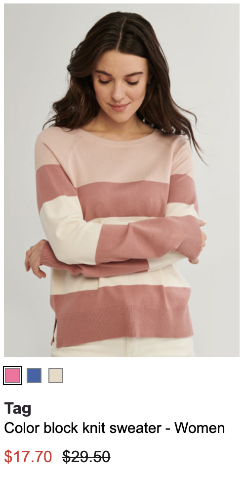
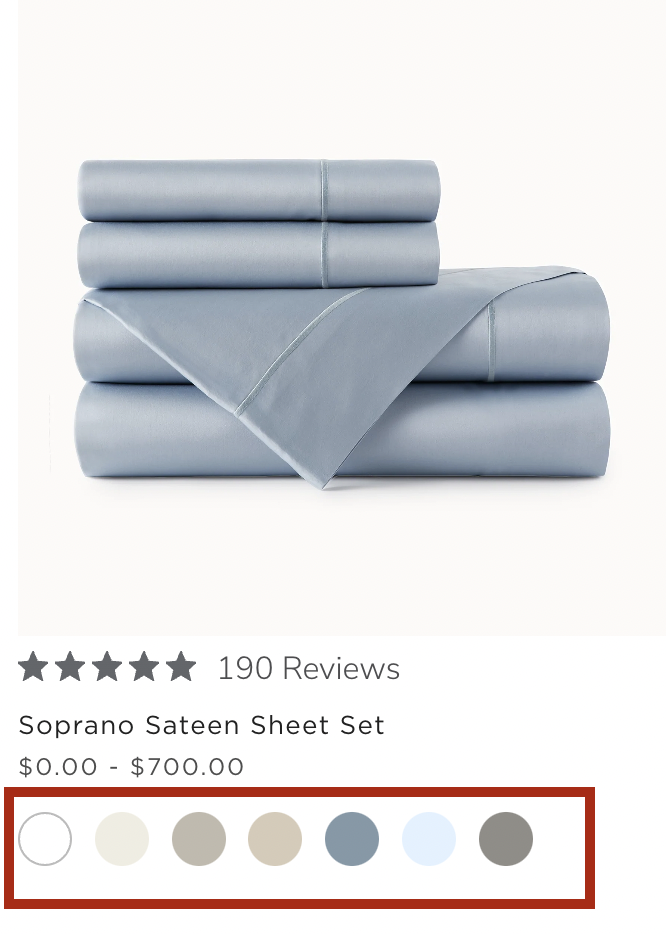

# Swatches
{: .no_toc }

# Table of contents
{: .no_toc .text-delta }

1. TOC
{:toc}

---

# Definition
In e-commerce, 'swatches' refer to small graphical representations of a product's color, pattern, or texture that can be used to indicate the available options for a certain variant of a product. Swatches are commonly used to display the available colors of a product, such as clothing or home decor, allowing the users to see a visual representation of the options before they purchase.

Swatches are usually displayed in a grid or list format, and when a user clicks on one of the swatches, the main product image will change to display the selected color or variant. They are commonly used in conjunction with the variant selection options, like color or pattern drop-down list or thumbnails.

Swatches can also be used for non-color related variations, like for example for the different types of fabric for a piece of clothing or for the different materials of a furniture item.

The main advantage of swatches is that it allow users to get a better sense of the product before purchasing and also, it can make it easier for the user to find the exact variant they are looking for by just looking at the visual representation.

# Behavior

Configure swatches display by using the configs in this section.  
[](https://unbxd.com/docs/wp-content/uploads/2020/05/swatches-sdk.png)

{: .warning } 
NOTE: If you have want to include swatches, please ensure the `count` field inside the `variants` config to be more than 1, and `groupBy` field should have a corresponding mapping in the `mapping` key as shown in the below variants config example:

```js
variants:{
       enabled:false,
       count:5,
       groupBy:'v_imageUrl',
       attributes:[
           "title",
           "v_imageUrl"
       ],
       mapping:{
           "image_url":"v_imageUrl"
       }
   }
```


# Configurations

The following options are available under the swatches object:

``` js
swatches:{
// the below swatches configurations goes here.
}
```

## enabled
{: .d-inline-block }

Boolean
{: .label }
Required
{: .label .label-red }

“Enabled” is a flag or switch that allows developers to turn on or off a specific feature in an e-commerce website. In this context, the  "Swatches feature” refers to the ability to display swatches on the website.

When the “enabled” flag is turned on, the swatches feature will be active. When the “enabled” flag is turned off, the swatches feature will be disabled.
### Default Value
{: .no_toc }
```js
enabled: false
```

### Scenarios
{: .no_toc }
1. `true`  - Swatches feature will be enabled.
2. `false` - Swatches feature will be disabled.


---
## attributesMap
{: .d-inline-block }

Object
{: .label  }

Field mapping of the catalog attributes to the swatch attributes

### Default Value
{: .no_toc }
```js
attributesMap:{
    "swatchImgs": "unbxd_color_mapping",
    "swatchColors": "color", 
    "swatchList": "color"
}
```

---
## swatchClass
{: .d-inline-block }

String
{: .label  }

Additional CSS class name for the swatches

### Default Value
{: .no_toc }
```js
swatchClass:"UNX-swatch-btn"
```

### Scenarios
{: .no_toc }

Any valid class name can passed here.

---
## template
{: .d-inline-block }

Function
{: .label  }

Customize the look and feel of the swatches component by returning your custom HTML string from this function. This function gets the current swatch data and complete swatches list as parameters

This function takes three params:
1. `swatchData` - swatchData contains data related to swatches, like images.
2. `swatches` - Swatches object contains swatchClass, which use to design swatch component.
3. `product` - it is an object which conatans info related to product like unxTitle.

**Expected return value**: a string of HTML that will be used to render the swatches component on the webpage

### Default Value
{: .no_toc }
```js
template:function(swatchData, swatches,product) {
    const {
        swatchImgs = []
    } = swatchData;
    let btnUI = ``;
    let btnList = ``;
    let imgsUI = ``;
    const {
        swatchClass
    } = swatches;
    const {
        UNX_swatchClrBtn
    } = this.testIds;
    const {
        unxTitle
    } = product;
    if(swatchImgs.length > 1) {
        swatchImgs.forEach((item,id) => {
            const sid = this.generateRid("unx_swatch_");
            const sCss = (id === 0) ? '':' UNX-swatch-hidden';
            const bCss = (id === 0) ? ' UNX-selected-swatch':'';
            const data = item.split("::");
            if(data){
                btnUI+= [`<button value="swatch color ${data[0]}" data-test-id="${UNX_swatchClrBtn}${id}" data-swatch-id="${sid}" data-action="changeSwatch" class="${swatchClass} ${sid} ${bCss}" style="background-color:${data[0]}"> swatch color ${data[0]} </button>`].join('');
                imgsUI+=`<div id="${sid}" class="UNX-img-wrapper ${sCss}"></div>`
            }
        });
        btnList = `<div class="UNX-swatch-color-list">${btnUI}</div>`;
    }
    return {
        btnList:btnList,
        imgList:imgsUI,
    };
}
```
### Scenarios
{: .no_toc }
For additional information on custom scenarios, please refer to the [use cases section](#usecases) located below.

---


# UseCases
## Usecase 1: Default Example
Sample “swatches” config

[](https://unbxd.com/docs/wp-content/uploads/2020/05/swatches-sdk.png)

```js
swatches:{
       enabled:true,
       attributesMap:{},
       swatchClass:'UNX-swatch-btn',
       template:function(swatchData) {
           const {
               swatchColors = [],
               swatchImgs = []
           } = swatchData;
           let btnUI = ``;
           swatchColors.forEach((item,id) => {
               const imgId = swatchImgs[id];
               if(imgId){
                   const img = imgId.split("::")[1];
                   btnUI+= [`<button data-swatch-id="${item}" data-swatch-img="${img}" data-action="changeSwatch"`,
 `data-swatch-target=".UNX-img-block" class="${this.swatchClass}" style="background-color:${item}"> </button>`].join('')
               }
           });
           return `<div class="UNX-swatch-color-list">${btnUI}</div>`;
       }
   }
```
---

## Usecase 2:



```js
products:{
    template: function (product, idx, swatchUI, productViewType, products) {
            const {
                uniqueId,
                imageUrl,
                Images,
                Name,
                Price,
                AdjustedPrice,
                productUrl,
                Attr_5637150579,
                ColorHexMapping,
                ColorImageVariantMapping,
                Brand,
                score
            } = product;


            const {
                productItemClass
            } = products;

            let imageurl = Array.isArray(imageUrl) ? imageUrl[0] : imageUrl;

            let displayPrice = ``;
            var swatchBtnUI = ``;
            var btnList;
            var imgList;
            if (swatchUI) {
                btnList = swatchUI.btnList;
                imgList = swatchUI.imgList
            }
            if (btnList) {
                swatchBtnUI = '<div class="UNX-swatch-wrapper">' + btnList + '</div>';
            }
            if (imgList) {
                imagesUI = imgList;
            }

            newimageUrl = imageUrl[0];
            var custAdjustedPrice;
            if (AdjustedPrice != Price) {
                custAdjustedPrice += '<span class="msc-price__strikethrough" aria-hidden="true">$' + AdjustedPrice.toFixed(2) + '</span><span aria-hidden="true" class=""><span class="msc-price__actual" itemprop="price">$' + Price.toFixed(2) + '</span></span>'
            } else {
                custAdjustedPrice += '<span aria-hidden="true" class=""><span class="msc-price__actual" itemprop="price">$' + Price.toFixed(2) + '</span></span>'
            }
            var SwatchIm = newimageUrl.split('Products/')
            var swatchHtml = '';
            if (ColorHexMapping && ColorImageVariantMapping) {
                var json = ColorHexMapping;
                var swatches = JSON.parse(json);
                var swatchImage = JSON.parse(ColorImageVariantMapping);
                for (var i = 0; i < swatches.length; i++) {
                    if (i == 0) {
                        swatchHtml += "<li class='color-swatch selected' role='button' value='" + SwatchIm[0] + 'Products/' + swatchImage[i].Url + '&w=357&h=535&q=80&m=6&f=jpg' + "'><button style='background-color:" + swatches[i].Hex + "'></button></li>"
                    }
                    else {
                        swatchHtml += "<li class='color-swatch' role='button' value='" + SwatchIm[0] + 'Products/' + swatchImage[i].Url + '&w=357&h=535&q=80&m=6&f=jpg' + "'><button style='background-color:" + swatches[i].Hex + "'></button></li>"
                    }
                }
            }
            return [`
            <li class="ms-product-search-result__item" id="${uniqueId}" data-id="${uniqueId}" data-s="${uniqueId}" unbxd-title="${Name}" unbxd-price="${Price}" unbxdattr="product" unbxdparam_sku="${uniqueId}" unbxdparam_prank="${idx}" unbxdparam_requestId="${window.unbxdSearch.state.requestId}">
                <div aria-label="" class="msc-product has-sale">
                    <a href="/en${productUrl}">
                        <div role="link" class="msc-product__image">
                            <div class="msc-empty_image-placeholder">
                                <picture>
                                    <source class="sourceImage" data-srcset="${newimageUrl}&w=357&h=535&q=80&m=6&f=jpg"  media="(max-width:768px)" srcset="${newimageUrl}&w=357&h=535&q=80&m=6&f=jpg">
                                    
                                </picture>
                            </div>
                        </div>
                    </a> 
                    <ul class="custom-swatches">
                        ${swatchHtml}
                    </ul>
                    <a href="/en${productUrl}">
                        <div role="link" class="msc-product__details">
                        <div class="UNX-brand">${Brand ? Brand : ''}</div>
                            <h4 class="msc-product__title">${Name}</h4>
                                <span class="msc-price">${custAdjustedPrice.replace('undefined', '')}</span>
                                <p class="msc-product__text">${Attr_5637150579 == "In-store only" ? Attr_5637150579 : ''}</p>
                        </div>
                    </a>
                </div>
            </li>`].join('');
        },
        onEvent: function (context, type) {
        if (type == 'AFTER_RENDER') {
            var swatchItem = document.getElementsByClassName('color-swatch');
            for (var i = 0; i < swatchItem.length; i++) {
                swatchItem[i].onclick = function () {
                    var parentDOM = this.parentElement;
                    var existing = parentDOM.getElementsByClassName('selected');
                    existing[0].className = existing[0].className.replace('selected', '');
                    this.className += " selected";
                    var closeEle = this.closest('.ms-product-search-result__item');
                    var swatchImg = closeEle.getElementsByClassName('selected')[0].getAttribute("value")
                    closeEle.getElementsByClassName('unbxdImage')[0].setAttribute("src", swatchImg);
                    closeEle.getElementsByClassName('sourceImage')[0].setAttribute("srcset", swatchImg);
                    closeEle.getElementsByClassName('sourceImage')[0].setAttribute("data-srcset", swatchImg);
                }
            }
            
        }
    }
}
```
---
## Usecase 3: 



```js
//other configs goes here ...
products: {
        // other products config here ...
        productAttributes: [
            //other product attributes here
            'swatches'
        ],
        attributesMap: {
            //other attribute maps goes here
            "unxSwatches": "swatches"
        },
        template:function(product, idx, swatchUI, productViewType, products ){
            var unxTitle = product.unxTitle;
            var unxBadge = product.unxBadge;              
            var uniqueId = product.uniqueId;
            var unxVariants = product.unxVariants;
            var unxMinPrice = product.unxMinPrice;
            var unxMaxPrice = product.unxMaxPrice;
            var unxhover = product.unxhover;
            var unxSwatches = product.unxSwatches;
            var unxImageUrl = product.unxImageUrl;
            var unxImageUrls = product.unxImageUrls;
            var unxProductUrl = product.unxProductUrl;
            var unxMinRegPrice = product.unxMinRegPrice;
            var unxMaxRegPrice = product.unxMaxRegPrice;
            var unxDescription = product.unxDescription;
            var productItemClass  = products.productItemClass;
            var unxRelevantDocument = product.unxRelevantDocument;
            var variantProducts = Array.isArray(unxVariants) ? unxVariants[0] : '';
            var v_ImgSrc1 = variantProducts.v_Variant_Image;
            var imgSrc1 = Array.isArray(unxImageUrl) ? unxImageUrl[0] : '';  
            var imgSrc2 = Array.isArray(unxImageUrls) ? unxImageUrls[0] : '';  
            if(unxRelevantDocument == 'variant'){                  
                var imagesUI =(
                    `<div id="UNX-img-wrapper">
                        
                        
                        
                    </div>`
                );
            } 
            if(unxRelevantDocument == 'parent'){                     
                var imagesUI =(
                    `<div id="UNX-img-wrapper">
                        
                        
                        
                    </div>`);
            }
            var priceUI = '';
            if ( unxMinPrice == unxMaxPrice && unxMinRegPrice == unxMaxRegPrice && unxMinPrice != null && unxMinPrice != undefined && unxMinRegPrice != null && unxMinRegPrice != undefined ) {
                priceUI += '<span class="UNX-min-price">$ '+ unxMinPrice + '.00</span><span class="UNX-min-reg-price" style="color:gray !important"> $ '+ unxMinRegPrice + '.00</span>'
            } else if(unxMinPrice < unxMaxPrice && unxMaxRegPrice < unxMinRegPrice){
                priceUI = '<span class="UNX-min-price">$ '+ unxMinPrice + '.00</span><span class="UNX-max-price"> - $ '+ unxMaxPrice + '.00</span> <span class="UNX-min-reg-price"> $ '+ unxMinRegPrice +'.00</span><span class="UNX-max-reg-price"> - $ '+ unxMaxRegPrice +'.00</span>'
            } else if (unxMinPrice == unxMaxPrice) {
                priceUI += '<span class="UNX-min-price" style="color:gray !important">$ '+ unxMinPrice + '.00</span>'
            } else if (unxMinPrice === unxMaxPrice && unxMinRegPrice != null && unxMinRegPrice != undefined) {
                priceUI = '<span class="UNX-min-price" style="color:gray !important">$ '+ unxMinPrice + '.00</span><span class="UNX-max-price" style="color:gray !important"> - $ '+ unxMaxPrice + '.00</span>'
            } else if(unxMinPrice !== null && unxMinPrice !== undefined && unxMaxPrice !== null &&  unxMaxPrice !== undefined && unxMinRegPrice !== null && unxMinRegPrice !== undefined && unxMaxRegPrice !== undefined && unxMaxRegPrice !== null){
                priceUI = '<span class="UNX-min-price">$ '+ unxMinPrice + '.00</span><span class="UNX-max-price"> - $ '+ unxMaxPrice + '.00</span> <span class="UNX-min-reg-price"> $ '+ unxMinRegPrice +'.00</span><span class="UNX-max-reg-price"> - $ '+ unxMaxRegPrice +'.00</span>'
            } else if(unxMinPrice !== null && unxMinPrice !== undefined || unxMinRegPrice !== null && unxMinRegPrice !== undefined || unxMaxRegPrice !== undefined && unxMaxRegPrice !== null){
                priceUI = '<span class="UNX-min-price" style="color:gray !important">$ '+ unxMinPrice + '.00</span><span class="UNX-max-price" style="color:gray !important"> - $ '+ unxMaxPrice + '.00</span>'
            } else if(unxMinPrice !== null && unxMinPrice !== undefined || unxMinRegPrice !== null && unxMinRegPrice !== undefined && unxMaxRegPrice !== undefined && unxMaxRegPrice !== null){
                priceUI = '<span class="UNX-min-price">$ '+ unxMinPrice + '.00</span><span class="UNX-max-price"> - $ '+ unxMaxPrice + '.00</span> <span class="UNX-min-reg-price"> $ '+ unxMinRegPrice +'.00</span><span class="UNX-max-reg-price"> - $ '+ unxMaxRegPrice +'.00</span>'
            } else if(unxMinPrice !== null && unxMinPrice !== undefined && unxMinPrice == unxMaxPrice && unxMinRegPrice !== undefined && unxMaxRegPrice !== undefined && unxMinRegPrice == unxMaxRegPrice){
                priceUI = '<span class="UNX-min-price">$ '+ unxMinPrice + '.00</span><span class="UNX-min-reg-price">$ '+ unxMinRegPrice + '.00</span>'
            } else if(unxMinPrice < unxMaxPrice || unxMaxRegPrice < unxMinRegPrice){
                priceUI = '<span class="UNX-min-price">$ '+ unxMinPrice + '.00</span><span class="UNX-max-price"> - $ '+ unxMaxPrice + '.00</span> <span class="UNX-min-reg-price"> $ '+ unxMinRegPrice +'.00</span><span class="UNX-max-reg-price"> - $ '+ unxMaxRegPrice +'.00</span>'
            }
            var cardType = "";
            var descUI = "";
            if(productViewType === "GRID") {
                cardType = "UNX-grid-card"
            } else {
                cardType = "UNX-list-card";
                descUI = '<p class="UNX-description">'+unxDescription+'</p>';
            }
            var swatchHtml =``;
            var unxSwatchImg = unxImageUrls;
            var unxSwatch = unxSwatches;
            if(unxSwatch && unxSwatchImg){
                for(var i=0; i < unxSwatchImg.length; i++){
                    if(i == 0 ){
                    swatchHtml += `<span data-color="${unxSwatchImg[i].split(':')[0]}" role='button' data-varimg="${unxSwatchImg[i].split(':')[1]}:${unxSwatchImg[i].split(':')[2]}&amp;width=165 165w" class="swatch-element selected color ${unxSwatchImg[i].split(':')[0]}">
                                    <div class="faux-label color-swatches color-swatch--${unxSwatchImg[i].split(':')[0].toLowerCase().replace(" ", "-")}" style="background-color:${unxSwatchImg[i].split(':')[0].toLowerCase().replace(" ", "-")}">
                                    <div class="visually-hidden">${unxSwatchImg[i].split(':')[0]}</div>
                                    </div>
                                    </span>`
                    } else if(i <=6 ){
                    swatchHtml += `<span data-color="${unxSwatchImg[i].split(':')[0]}" role='button' data-varimg="${unxSwatchImg[i].split(':')[1]}:${unxSwatchImg[i].split(':')[2]}&amp;width=165 165w" class="swatch-element color ${unxSwatchImg[i].split(':')[0]}">
                                    <div class="faux-label color-swatches color-swatch--${unxSwatchImg[i].split(':')[0].toLowerCase().replace(" ", "-")}" style="background-color:${unxSwatchImg[i].split(':')[0].toLowerCase().replace(" ", "-")}">
                                    <div class="visually-hidden">${unxSwatchImg[i].split(':')[0]}</div>
                                    </div>
                                    </span>`
                    }
                    else if(i == 7){
                        swatchHtml += `<span class="underline">
                                            <span class="small--hide">More...</span>
                                            <span class="medium-up--hide">+</span>
                                        </span>`
                        }
                    }
                }
            var unxBadges = '';
            if(unxBadge == "Online Exclusive" || unxBadge == "New Colors" || unxBadge == "Best Seller" || unxBadge == "Top Rated"){ 
                unxBadges='<span class="UNX-badges badge">'+ unxBadge +'</span>' 
            }
            return ['<li id="UNX-products" unbxdattr="product" unbxdparam_sku="'+uniqueId+'" unbxdparam_prank="'+idx+'" class="UNX-product-col '+cardType+' '+productItemClass+'" unbxdparam_requestId='+window.unbxdSearch.state.requestId+'>',
                        '<div class="UNX-view-item" >',
                        '<div class="UNX-badge">'+unxBadges+'</div>',
                        '<a class="UNX-product-tile" href="'+unxProductUrl+'">', 
                                imagesUI,
                                '<div class="UNX-product-content">',
                                '<div class="UNX-product-title">'+unxTitle+'</div>',                            
                                '<span class="UNX-price-row">'+priceUI+'</span>',
                                '<div class="UNX-swatch swatch card-grid-colors">'+swatchHtml+'</div>',
                                '<style>url();</style>',
                                '<style>url();</style>',
                                '<style>url();</style>',
                                '</div>',
                        '</a>',
                        '</div>',
                    '</li>'].join('');
        },
        onEvent: function (context, type) {
            if(type == 'AFTER_RENDER'){
            var swatchItem = document.getElementsByClassName('swatch-element');
            for (var i = 0; i < swatchItem.length; i++) {
                swatchItem[i].onclick = function (e) {
                    e.preventDefault();
                var parentDOM = this.parentElement;
                var existing = parentDOM.getElementsByClassName('selected');
                existing[0].className = existing[0].className.replace('selected','');
                this.className += " selected";
                var closeEle =this.closest('.UNX-product-col');
                var swatchImg = closeEle.getElementsByClassName('selected')[0].getAttribute("data-varimg")
                closeEle.getElementsByClassName('image_on')[0].setAttribute("src",swatchImg);
                closeEle.getElementsByClassName('image_on')[0].setAttribute("srcset",swatchImg);
                closeEle.getElementsByClassName('image_on')[0].setAttribute("data-srcset",swatchImg);
                }
            }
}
            }
    }
```
