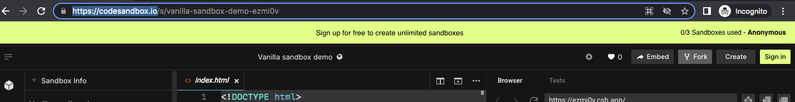
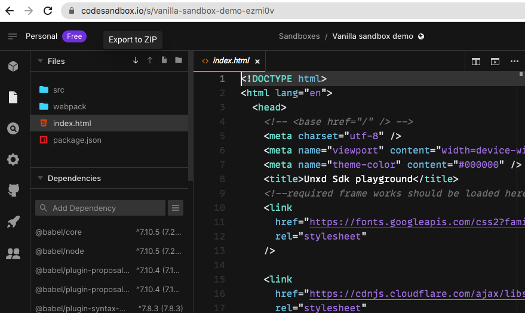

1. TOC
{:toc}

# JS Demo Playground
{: .fs-9 }

The below steps will help you view a demo of how the search sdk works. 
It is a simple ecommerce website with search & category pages. 
The latest unbxd search sdk is integrated with the same. 
The demo data is of fashion vertical.

{: .important }
> Note: We are using the Unbxd demo sitekey here. If you want to use your custom site details, go to [Integrate with your site](./integratewithyoursitedetails)

1. Create an account & sign in to [https://codesandbox.io](https://codesandbox.io)(**Optional**, but **recommended**, so as to get unlimited free codesandboxes)
2. Hit [demo code url](https://codesandbox.io/s/vanilla-sandbox-demo-ezmi0v) in browser.
3. Click on the Fork Button
    [](Fork the demo sandbox)
4. Open the website url generated on the RHS in a new tab, to view the demo website.

{: .important }
> Note: One can play around with the config. Post saving, the changes should be reflected in the generated website url.

# Setup in local
{: .fs-9 }


The below steps will help you set up a simple ecommerce website with search & category pages in your local machine. The latest unbxd search sdk is integrated with the same. 
The demo data is of fashion vertical.

1. Hit [demo playground url](https://codesandbox.io/s/vanilla-sandbox-demo-ezmi0v) in browser.
2. Click on Export to ZIP option.

    [](ZIP from codesandbox)
3. Unzip the folder
4. Run the following commands in terminal inside the unzipped folder:<br/>
Install required version of node using nvm:<br/>
```nvm install v14.15.0```<br/>
Use that version of node:<br/>
```nvm use v14.15.0```<br/>
Install dependencies:<br/>
```npm install```<br/>
Run the webpack server:<br/>
```npm run start```<br/>

{: .important }
> Additional links for above tools:<br/>
[Download Node](3https://nodejs.org/en/download/)<br/>
[Setup nvm](https://nodesource.com/blog/installing-node-js-tutorial-using-nvm-on-mac-os-x-and-ubuntu/)<br/>


