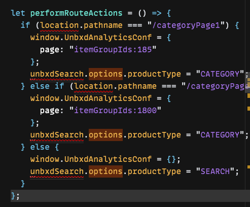

# JS Demo Playground
{: .fs-9 .no_toc}

The below steps will help you view a demo of how the search sdk works. 
It is a simple ecommerce website with search & category pages. 
The latest unbxd search sdk is integrated with the same. 
The demo data is of fashion vertical.

1. Create an account & sign in to [Sandbox Playground](https://codesandbox.io)(**Optional**, but **recommended**, so as to get unlimited free codesandboxes)
2. Hit [demo code url](https://codesandbox.io/s/vanilla-sandbox-demo-ezmi0v) in browser.
3. Click on the Fork Button
    [](Fork the demo sandbox)
4. Customize the config inside **src/js/index.js** as per the feed:
    1. Change **siteKey** and **apiKey**.
    ```js
    siteKey: "<<site key>>",
    apiKey: "<<api key>>"
    ```
    2. Modify **attributesMap** inside **products** object.
        ```js
        attributesMap: {
        "unxTitle": "<<title attribute>>",
        "unxImageUrl": "<<image url attribute>>",
        "unxPrice": "<<price attribute>>",
        "unxDescription":"<<description attribute>>"
        };
        ```
    3. Provide **product attributes** to be returned from the search api:
        ```js
        productAttributes: ["<<title attribute>>","<<image url attribute>>","<<price attribute>>","<<description attribute>>"]
        ```
    4. Configure the correct category ids for the **UnbxdAnalyticsConf** window object in the   following places:<br/>

        [](UnbxdAnalyticsConf variable configuration)
        
        [](UnbxdAnalyticsConf variable configuration)<br/>
5. Open the website url generated on the RHS in a new tab, to view the demo website.

{: .note }
> Note: One can play around with the config. Post saving, the changes should be reflected in the generated website url.


